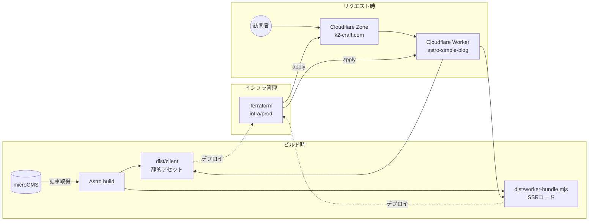

# 概要

WordPressサイト (https://www.voyage-to-the-new-world.com/) を、microCMS + Astro + Cloudflare Workers構成にモダン化するプロジェクト。

技術選定の背景は [ADR/0001-tech-stack.md](./ADR/0001-tech-stack.md) を参照。

本番URL: https://k2-craft.com

## アーキテクチャ



- **記事コンテンツ**: microCMSで管理。Astroがビルド時にAPI経由で取得し、ページとして焼き込む(実行時にmicroCMSへは問い合わせない)
- **アプリ本体**: Astro(`app/`)。`pnpm run deploy`でビルド後、esbuildで単一ファイルのWorkerコード(`dist/worker-bundle.mjs`)と静的アセット(`dist/client`)を生成する
- **配信**: Cloudflare Worker(`astro-simple-blog`)がSSRと静的アセット配信を両方担う。カスタムドメイン(`k2-craft.com`)経由でリクエストを受ける
- **インフラのコード管理**: Cloudflareの Zone / DNS / Worker はすべて`infra/prod/`のTerraformで管理し、`wrangler deploy`は使わない。stateは`infra/bootstrap`で作成したR2バケットに保存する

## 構成

- **記事の管理・編集**: [microCMS](https://microcms.io/)（管理画面はmicroCMS側のものをそのまま使用）
- **サイト本体**: `app/` — Astro製。microCMSから記事を取得してビルド・配信する
- **移行ツール**: `scripts/` — WordPressの記事をmicroCMSへ一度だけ移すためのスクリプト群
- **インフラ**: `infra/` — Cloudflareリソース(Zone/DNS/Worker/KV)をTerraformで管理する

## セットアップ

```bash
cd app && pnpm install
```

`scripts/`配下の移行ツールはNode.js標準機能のみで動くため、インストール不要。

Node.js 24以上が必要（`.nvmrc`参照）。package.jsonは`app/`のみに存在する。

`app/.env` に microCMS の接続情報を設定する。

```
MICROCMS_API_KEY=xxxxxxxxxx
MICROCMS_SERVICE_DOMAIN=xxxxxxxxxx
```

## サイトを動かす(app/)

```bash
cd app
pnpm dev          # ローカル確認 (http://localhost:4321)
pnpm build        # ビルド
pnpm run deploy   # ビルド + Worker用に単一ファイルへバンドル (pnpm deployは予約コマンドと衝突するため不可)
```

`pnpm run deploy` はビルドとバンドルまでで、実際の本番公開は次節のTerraformで行う。

## インフラを変更する(infra/)

CloudflareのZone/DNS/Worker/KVはすべて`infra/prod/`のTerraformで管理する。`wrangler deploy`は使わない。

### 初回のみ: state用R2バケットをTerraform管理に取り込む

state用R2バケット(`blog-tfstate`)は既存のものを使う。新規作成はしない。

```bash
cd infra/bootstrap
terraform init
terraform import cloudflare_r2_bucket.tfstate '<account_id>/blog-tfstate/default'
terraform plan   # 差分がないことを確認
```

### 通常のデプロイ

```bash
# 1. アプリをビルドしてWorker用バンドルを作る
cd app && pnpm run deploy

# 2. インフラごとTerraformで適用する(Worker本体の公開もここで行われる)
cd ../infra/prod
terraform init -backend-config=backend.hcl   # 初回、または backend.hcl.example を参照して用意
terraform plan
terraform apply
```

- Cloudflare APIトークン(スコープを絞ったもの)は `infra/*/terraform.tfvars` の `cloudflare_api_token` に設定する(`terraform.tfvars`はgit管理外)
- R2 backend用のS3互換認証情報(Access Key ID / Secret Access Key)は `infra/prod/backend.hcl` に直接設定する(こちらもgit管理外)

どちらもコミット対象のファイルには書かない。

既存リソースをTerraform管理下に置く(import)際は `cf-terraforming` で実構成からHCLを生成し、`infra/prod/`のスケルトンと突き合わせてから `terraform import` する。
