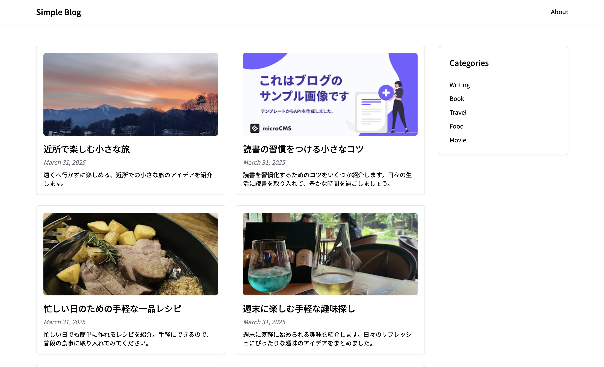
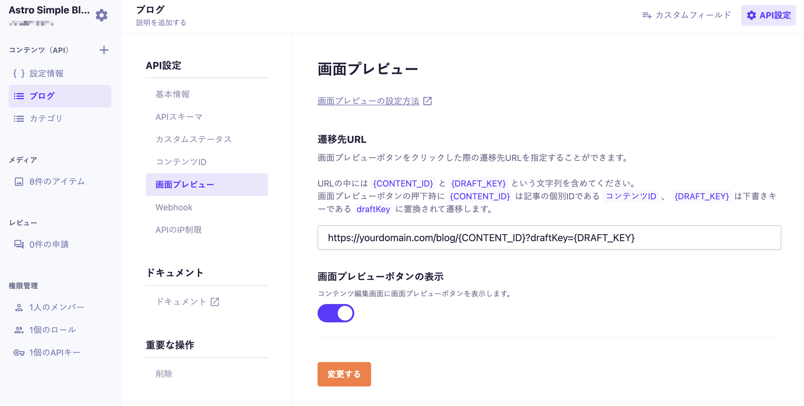

# Astroを使用したシンプルなブログ



Astroを使用したシンプルなブログのテンプレートです。

## 動作環境

Node.js 24 以上

## 環境変数の設定

ルート直下に`.env`ファイルを作成し、下記の情報を入力してください。

```
MICROCMS_API_KEY=xxxxxxxxxx
MICROCMS_SERVICE_DOMAIN=xxxxxxxxxx
```

`MICROCMS_API_KEY`  
microCMS 管理画面の「サービス設定 > API キー」から確認することができます。

`MICROCMS_SERVICE_DOMAIN`  
microCMS 管理画面の URL（https://xxxxxxxx.microcms.io）の xxxxxxxx の部分です。

## 開発の仕方

1. パッケージのインストール

```bash
pnpm install
```

2. 開発環境の起動

```bash
pnpm dev
```

3. 開発環境へのアクセス  
   [http://localhost:4321](http://localhost:4321)にアクセス

## 画面プレビューの設定

下書き状態のコンテンツをプレビューするために、microCMS管理画面にて画面プレビューの設定が必要です。

ブログAPIの「API設定 > 画面プレビュー」に下記のように設定してください。  
※`yourdomain.com`は環境に合わせて置き換えてください。（localhost指定でも動作します）



設定後はコンテンツ編集画面にて画面プレビューボタンが利用可能になります。

## Cloudflare Workersへのデプロイ

このプロジェクトは `@astrojs/cloudflare` アダプター構成済みです。

```bash
pnpm run deploy
```

- `pnpm deploy`(runなし)はpnpmの予約コマンドと衝突するため、必ず `pnpm run deploy` を使うこと
- `astro build` してから `wrangler deploy` を実行する。wrangler向けの設定ファイルはビルド時にAstroが自動生成するため、`wrangler.jsonc` を手書きする必要はない
- 本番URL: https://k2-craft.com

## バージョン固定について(意図的)

- **astro は `^6.x` に固定**: `@astrojs/cloudflare` の対応バージョン(13.x系)が `astro ^6.3.0` を要求するため。astro 7系にはまだ上げない(cloudflareアダプターを14系に上げる必要があり、動作未検証)
- **`@astrojs/cloudflare` は `^13.x` に固定**: 14系は astro 7系が前提のため
- **`vite` は `pnpm.overrides` で `7.3.6` に固定**: `@tailwindcss/vite` が引き込むvite 8系と、astro/cloudflareアダプターが要求するvite 7系が競合しビルドが壊れるため、明示的に1本化している

`pnpm update --latest` 等でこれらを一括更新すると壊れる可能性があるため、上げる場合は astro 7 + `@astrojs/cloudflare` 14系への移行として個別に検証すること。

## Node.js のバージョンについて

このテンプレートは **Node.js 24 以上**を前提としています。

Node.js では定期的にセキュリティアップデートが提供されています。  
安全にご利用いただくため、Node.js を利用する際は
**利用中のメジャーバージョン（例: 24.x）の最新パッチバージョンを使用することを推奨します。**

最新のセキュリティ情報については、以下をご参照ください。
https://nodejs.org/ja/blog/vulnerability/
