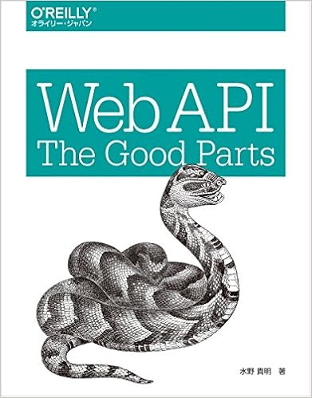

*https://www.amazon.co.jp/Web-API-Parts-%E6%B0%B4%E9%87%8E-%E8%B2%B4%E6%98%8E/dp/4873116864*

## 本の目的

WebAPIをどのように設計・運用すればより効果的なのかを、ありがちな罠・落とし穴を避けるにはどうすべきかを考えていく本。

インターンの延長上でAPIの理解を深めていきたいと思った。

## WebAPIなんぞや

URIにアクセスすることで、サーバー情報の書き換えやサーバー側に置かれた情報を取得できる。

データを機会的に利用できる

つまり、人間がアクセスすることを目的としていない。ブラウザでWebページを表示する際はJSON形式を採用している。

データをプログラムが取得して活用するものであること。

## 重要性

APIの存在が企業やサービスの価値や収益を左右するものである。

Twitterに投稿された仕組みをつかって分析するシステムやAmazonの商品を自分のサイトから紐づけて販売したりなどすることが可能になった。

いちから、人を雇って開発するよりかは既存のサービスと連携することが割安になったりもする。

APIを用意することで、さまざまなサービスと共存可能になったりする。

確かに、新しく入ったサイトでメールアドレスを入力してパスワード決めてなど、めちゃくちゃめんどくさいです。それがAPIだと楽に登録できるのは大きい進化では。

さまざまなWebAPIを集めて公開しているサービス。

APIディレクトリーサービス：[https://www.programmableweb.com/](https://www.programmableweb.com/)

## WebAPIを美しく設計する

以下で自分が読んでなるほどと思ったことを列挙する。

### 設計の美しいAPIは使いやすい

APIを作る場合はそのAPIを利用するのは自分ではない場合が多くなる。

### 設計の美しいAPIは恥ずかしくない

良い技術者は技術力のない企業・チームには参加しない。APIの設計の良さは優秀な人を左右する。

---

APIは公開されてこそ価値を生んでいくもの、APIの設計が優秀なエンジニアを集めるかもしれないこと。
