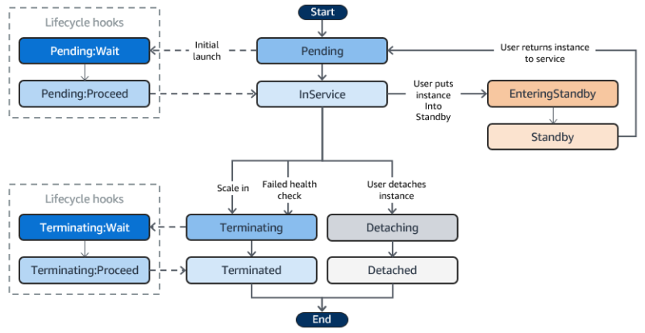

## はじめに

前回はEC2についてとりあげました。

EC2には、Auto Scalingというとても便利な機能が存在しています。その機能はどんなことができるのかみていきましょう。

## EC2 AutoScalingとは

**Auto Scaling**とは、サーバの負荷の上昇や故障などを検知して、自動的にEC2インスタンス数を増減させるクラウドならではの機能です。

Auto Scalingは、2つ存在します。

1.  EC2 Auto Scaling
2.  Application Auto Scaling

　今回は、EC2 Auto Scalingを取り扱います。

### EC2 Auto Scalingのメリット

メリットとしては2つ存在します。

1.  **コストを最適化できる**
    -   VPC上に配置したEC2インスタンスの需要に応じて自動的にインスタンスを削減できます
2.  **可用性を高めることができる**
    -   可用性…システムやサービスが、どれだけ継続して使えるかということ
    -   異常なインスタンスを発見すると切り離して新しいものに交換してくれます

ケイ

EC2 Auto Scalingめちゃくちゃ便利だとわかります。しかし、以下のポイントは押さえておきましょう。

### EC2 Auto Scalingの構成要素

EC2 AutoScalingは、3つの要素から成り立っています。

-   **Auto Scaling Group（Auto Scalingグループ）**
    -   スケジューリングに関わる全般設定を定義したグループ
    -   インスタンスの配置数の最小値・最大値の設定、ヘルスケアチェックを実施し、異常なインスタンスを自動的に置き換えるetc..
-   **Launch Configuration（起動設定）**
    -   Auto Scalingグループが新しいEC2インスタンスを起動する際に使用するテンプレートのこと
    -   AMI IDやインスタンスタイプ、キーペア、セキュリティグループetcを設定できる
-   **Scaling Plan（スケーリングプラン）**
    -   Auto Scalingグループのインスタンス数をどのように変更するかを定義
    -   特定の日付でインスタンス数を変更する。過去のデータから、将来の需要を予測してスケーリングする

EC2 AutoScalingの話のときはこの設定をするということを覚えておきましょう。

## Auto Scalingのライフサイクルのインタンス状態

Auto Scaling Groupに組み込まれたインスタンスは、必ず何らかのステータスが付与されます。各ステータスごとでさまざまなイベントやアクションが実行されます。

その状態遷移図は以下のとおりです。

このインタスタンスのステータスが変化することで、どんなイベントが起きるのか押さえておきましょう。

### EC2 Auto Scalingのステータス

ステータスをそれぞれざっくりまとめてみました。

| ステータス | 説明 |
| --- | --- |
| Pending | インスタンスの起動や初期化処理を行っている段階 |
| InService | インスタンスが正常起動されている状態 |
| Terminating | インスタンスの終了処理を行っている段階 |
| Terminated | インスタンスが終了した状態 |
| Detaching | Auto Scaling Groupからデタッチ処理されている状態 |
| Detached | インスタンスのデタッチ（取り外し）が完了した状態 |
| EnteringStandby | インスタンスがユーザーの操作により、「Standby」へ移行されている状態 |
| Standby | インスタンスが一時的に削除されている状態 |

詳細は、公式をのぞいてみましょう。

https://docs.aws.amazon.com/ja_jp/autoscaling/ec2/userguide/ec2-auto-scaling-lifecycle.html

## おわりに

EC2 Auto Scalingは基本的に無料です。ただし、EC2インスタンスの利用料金とCloudWatchのモニタリングの利用料金はかかるので注意しましょう。
