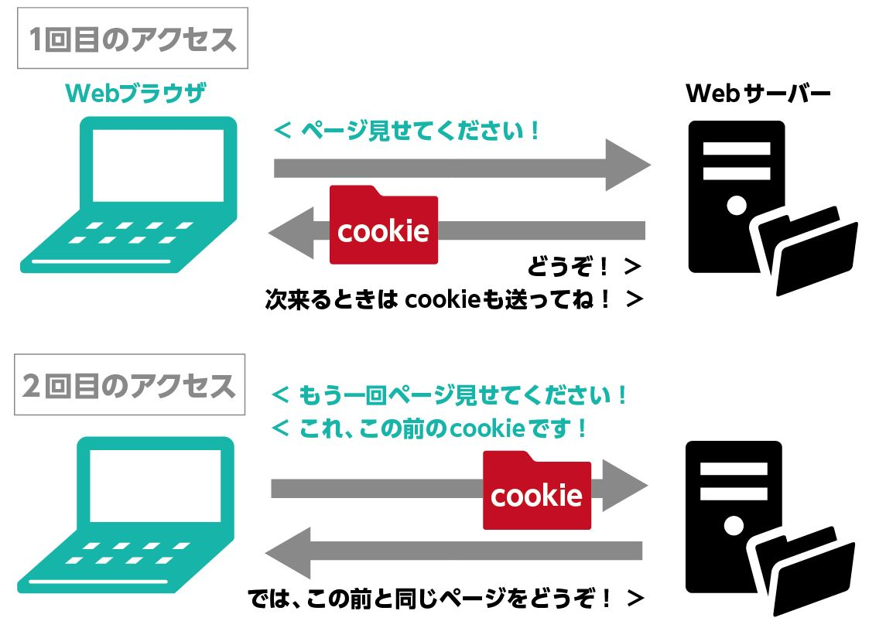

## はじめに

実務に1年ほど入って仕事をしてきたが、webの仕組みを人に説明してといわれてもできない。

ちゃっと説明できるようになりたいと思い何か読めそうな本がないかググってみたところのこの本に出会った。

技術には歴史や背景がある。それを知りたく読むことにした。

［改訂新版］プロになるためのWEB技術入門 ／ 技術評論社

-   [楽天市場](https://hb.afl.rakuten.co.jp/hgc/397e1518.1648ea30.397e1519.664875b1/Rinker_o_20250102114552?pc=https%3A%2F%2Fsearch.rakuten.co.jp%2Fsearch%2Fmall%2F%25EF%25BC%25BB%25E6%2594%25B9%25E8%25A8%2582%25E6%2596%25B0%25E7%2589%2588%25EF%25BC%25BD%25E3%2583%2597%25E3%2583%25AD%25E3%2581%25AB%25E3%2581%25AA%25E3%2582%258B%25E3%2581%259F%25E3%2582%2581%25E3%2581%25AEWeb%25E6%258A%2580%25E8%25A1%2593%25E5%2585%25A5%25E9%2596%2580%2F%3Ff%3D1%26grp%3Dproduct&m=https%3A%2F%2Fsearch.rakuten.co.jp%2Fsearch%2Fmall%2F%25EF%25BC%25BB%25E6%2594%25B9%25E8%25A8%2582%25E6%2596%25B0%25E7%2589%2588%25EF%25BC%25BD%25E3%2583%2597%25E3%2583%25AD%25E3%2581%25AB%25E3%2581%25AA%25E3%2582%258B%25E3%2581%259F%25E3%2582%2581%25E3%2581%25AEWeb%25E6%258A%2580%25E8%25A1%2593%25E5%2585%25A5%25E9%2596%2580%2F%3Ff%3D1%26grp%3Dproduct)

## さっそく感想

-   これからWeb開発をはじめていく人
-   Webエンジニアになりたい人
-   技術を磨いてきたい人

にもめちゃくちゃいい本である。「この技術ってなんで誕生したんだっけ？」の背景が、誕生の歴史をふまて記述されており読みやすい。

いくつかポイントをピックアップする。


中の人

点だけの知識がちゃんと線になるのは非常にいいです。

## 自分がポイントだと思ったところ


### CSSがうまれた理由

当時、htmlで文字の大きさ・色・書式など全て表されていた。商業的に使われるようになってくるとサイトの見た目がより重視されるようになった。

HTMLだけでは可読性が低下、メンテナンス困難だったため、CSSに変更されたようである。

### Webシステムの構造について

Webシステムは3つの要素から成立している。**クライアント**・**ネットワーク**・**サーバーサイド**この3つである。

クライアントサイドは、さらに5つの仕組みで形成されている。

-   デバイス
-   Webブラウザ
-   HTTPクライアント
-   レンダリングエンジン
-   Javascriptエンジン

デバイス上でWebブラウザを開き、HTTPサーバと通信を実施する。レンダリングエンジンが反応し、HTMLとCSSを解釈したら画像や動画などのコンテンツを生成する。

JavaScriptで記述されたプログラムが解釈をして、ダイナミックに動作が進行する。


はじめてちゃん

シンプルにクライアントの構造が理解できました。


中の人

意外と意識しないとこのあたりの知識ってわからないもんだよね

### サーバサイド

HTTPサーバとWebサーバ。この2つがサーバサイドの主要な要素である。

-   HTTPサーバは、HTTPリクエストを受け取り、要求に応じた結果をHTTPレスポンスとしてクライアントに返却する機能。
-   WebサーバはHTTPサーバの役割をもちつつ、静的コンテンツも提供する。

代表例はApacheが多くのシェアを誇っていたが、webサイトへのアクセス増加に対応しやすいものとしてnginxがシェアを伸ばしている。

### Webアプリケーション

Webサーバによって、静的コンテンツが提供されてからWebサイトが高速化されていくと動的コンテンツの比重が増加。Webサーバが提供する機能だけでは足りなくなってきたときに、Webアプリケーションが誕生する。

Webアプリケーションを実行する方式は5つ存在する。

-   プロセス起動方式
    -   HTTPリクエストを処理させるために、アプリケーションをその都度実行する方式
-   モジュール方式
    -   Webサーバの中にプログラム言語実行用のモジュールを組み込んで実行する方式
    -   プロセス起動方式で大量のアクセスがあったときに処理が間に合わないので、その問題を解決するために誕生
-   分離型独立プロセス方式
    -   WebサーバとWebアプリケーションの間の通信方式が2つ存在
        -   HTTP
        -   webサーバとアプリケーションを繋ぐ独自のプロトコル
            -   こちらは高速。FastCGI（PHP、Ruby）とかAJP（Java）
            -   いわゆるwebアプリケーション開発の領域かな
-   一体型独立プロセス方式
    -   分離型方式では、webサーバとwebアプリケーションを別々で用意しないといけなかった。
    -   小規模で高いパフォーマンスを求めないといけない。webアプリケーションが静的なコンテンツの提供もすることでこれらを実現
    -   webサーバを設置しないケースもある
    -   Node.jsやSpringbootもこれにあたる
-   アプリケーションサーバ方式
    -   アプリケーションサーバはその上で複数のwebアプリケーションを稼働・管理する機能を提供する。
    -   大規模なシステムなど。複数のwebアプリケーションに分割して開発し、それらを強調動作させることがあるため。
    -   代表例：Apach Tomcatなど
    -   近年では、減少傾向。仮想的なコンピュータをかず多く利用させることが一般的になったため。一体型独立プロセス方式が多く用いられている。


はじめてちゃん

こんなに起動方式があるんだ


そうそう。実際に使う場面は少ないと思うけど、しっておくといいかもしれないよね。

### Webアプリケーションフレームワーク誕生の背景

サーバサイドを構築する時に0から作るのは大変。HTMLを動的コンテンツとして同じように開発すべき処理も多数あり。（セッション管理機能とかも）

それを実現したのがフレームワークということである。

### ネットワークって

自分たちは、サービスプロバイダが提供している回線を通じて、スマホからネットへ接続し利用している。一方、開発にあたっては、大量のアクセスを捌かないといけない。

その際にポイントとなるのは、以下2つ。

-   ロードバランサ
    -   負荷分散装置。webシステムのリクエストを背後に控える複数のサーバへ割り振ることでシステム全体として多くの処理を可能にする
-   CDN
    -   高速かつ効率的に配信するのを実現した
    -   オリジンサーバ（webコンテンツのオリジナルを取得するサーバ）
    -   エッジサーバ（webシステム本体の代わりに世界各国に配置したサーバ）

### World Wide Webのはじまり

> もしもあらゆる場所にあるコンピュータに蓄積されている情報がすべてリンクされたとしたら、地球上のすべてのコンピュータが上の情報を、誰もが手に入れられる情報空間が生まれるだろう
> 
> by バーナーズ＝リー

インターネットを通じて情報を交換できるようにしたい。

その実現するための要素として、URI、HTTP、HTMLを提唱しました。

-   URIは情報の位置を示す方法
-   HTTPは情報の受け渡し方法
-   HTMLは情報の表現方法

この3つの仕様のもとWWWを実現すべく生まれたソフトウェアとして、WebサーバとWebブラウザが存在します。

## HTMLとXMLそれぞれの目的

HTMLとXMLには似たようなものですが、それぞれ異なる目的で存在しています。

### HTML

-   文書を表現する技術
-   見た目を重視する。ブラウザでの表示に焦点

```html
<div class="bookdetail">
  <p>
　　<span class="booktitle">タイトル</span>
　</p>
  <p>
   <span class="isbn">ISBN</span>
  </p>
</div>
```

### XML

-   データ構造を表現する技術
-   データを交換するという目的なら最適
-   情報の中身を重視し、データ構造を柔軟に指定

```xml
<?xml version="1.0" encodeing="UTF-8"?>
<book>
  <title>プロになるためのWeb技術入門</title>
  <isbn>985-22211</isbn>
  <publisher>技術評論社</publisher>
<book/>
```


それぞれに目的が存在したのですね

## Webアプリケーションの状態管理からの歴史の変遷

TODOアプリケーションで複数の人が同時に利用することを考えたとき、ログイン状態（クッキーに保存された状態が共有されていない）が引き継がれない。

ステートレスな通信とステートフルな通信が存在します。

### ステートレスとは

-   状態を持たない。HTTPはステートレスなものとして扱われる。
-   例：手紙のやりとり

### ステートフルとは

-   状態をもつ。FTPではステートフルなものとして扱われる。
-   例：電話


これまで話したことの状態を覚えてくれていてほしいものです。

### セッションとクッキーの台頭

通信の開始と終了までのことを**セッション（Session）**といいます。

HTTPにはこのセッションの考え方がない。Webアプリケーションでは独自に実装をしないといけないのです。HTTPを通信を識別して、互いに紐づける必要がある。

そこで利用されるのが**HTTP Cookie（HTTPクッキー）**と呼ばれます。



クッキーは発行元のサーバーと同じサーバにアクセスした時に、送信されます。

「同じサーバ」はどうやって見分けるのか？

これについては、以下の3つの要素で区別します。

-   スキーム（プロトコル）
-   ホスト（ドメイン）
-   ポート番号

### フレームワークの利便性について

Webアプリケーションとして、複数の利用者が同時に利用するといろいろと実現することが必要になりました。それを多くの実装でやらなければならない。実用に耐えるようにサーバサイド処理をしないといけない。

毎回つくるのが大変だというところでさまざまな処理や複雑さを肩代わりしてくれる存在がWebアプリケーションフレームワークとなります。


フレームワークが便利すぎてこの偉大さを感じにくいですよね笑

### フレームワークが提供する機能について

フレームワークはアプリケーションを開発する「骨組み」のことで、アプリケーションの土台となる共通部分を処理してくれます。

では具体的にどんな機能を提供するのか

1.  HTTPリクエスト受付・レスポンス構築
2.  パス・ルーテング
3.  認証・認可
4.  セッション管理
5.  テンプレート
6.  画面遷移
7.  静的コンテンツ
8.  データベースアクセス支援

この8つの機能を提供しています。


はじめてちゃん

ええ。こんなにも機能を提供しているんですね


技術選定の際にフレームワークを使う話がでてくるのはこの前提があってこそかもしれませんね。もちろん裏側の仕組みをしることも大事ですよね

## SPAへの進化

Webアプリケーションの普及していくゆえに課題がでてきました。

-   画面遷移が多く、遅い
-   サーバから通知ができないこと

### 画面遷移

Webアプリケーションの画面はHTMLで表現され、ブラウザで表示される。HTMLを生成するのはサーバの責務であった。変更内容が一部でも、全画面をサーバが生成してHTMLを描画しなおす手順が発生。


はじめてちゃん

そういうことか〜


そうそう。1箇所の変更ですべての処理が走るのはだるいよね。競プロとかしている人には計算量とかで算出できそう笑

### サーバ通知問題

表示内容の自動更新も苦手。

HTTPはクライアントがサーバへ情報を要求することを基本としている。リクエストを送信しなければ情報の新たな変化がわからない。株価や為替相場など逐一変化する情報を即時に表示するもできない。

## Ajaxによる進化

GmailやGoogleMapが登場した頃に提唱されたこのAjax。

ページ全体をリロードすることなくサーバーとの非同期通信が可能になりました。非同期の通信には2つの手段があります。

### XMLHttpRequest

伝統的な技術の**XMLHttpRequest**ですね。

```js
function sendXhr(){
  const xhr = new XMLHttpRequest();  // XMLHttpRequestオブジェクトの生成
  xhr.open("GET", "/todo");          // リクエストメソッドとリクエストパスの設定 
  xhr.onload = () => {               // onloadイベントハンドラの設定
  }
  xhr.send();　　　　　　　　　　　　　　 // GETリクエストの送信
}
```

### FetchAPI

ECMAScript 2015で導入された比較的新しい標準APIです。よりシンプルに記述しています。

```js
function dbFetch(){
  fetch("/todo")
   .then((request) => request.text())　　　// HTTPレスポンスヘッダ部分までを受け取ったときに呼び出される
   .then((text) => {　　　　　　　　　　　　　// レスポンスボディをすべて受けとったときに呼び出される
    // 実行内容記述
 })
}
```

コールバック地獄問題（非同期が連鎖するようなケース）というものが発生し、コードの可読性が損なわれてしまったことがあげられます。


はじめてちゃん

サーバーにリクエストを送信→レスポンスを受け取るというところは変わってないけど、何がちがうの？


おしゃる通りやっている内容は同じで、どのように処理が進行するのかが変更した点です。

従来は応答するのに待機しないと画面の操作ができなくなっていました。非同期処理ではその時間を待つことなく操作が可能になりました。

### jsonが普及した理由

サーバからの処理結果をHTTPレスポンスとして返却する際に、返す形式に決まりはなかった。一方で、Ajaxの考え方では、ここでXMLが使用されると説明している。

XMLを利用するとしたが、XMLをパース（プログラム上で扱えるようにするデータを解釈）する処理が重いのが欠点であり、それを補うものとしてJSON「JavaScript Object Notation：ジェイソン」が活用された。

```jsonc
{
　　"id": "8agajgaklhalhalhgagka",
   "todo": "ティッシュをかう"
}
```

JSONの強みは、JavaScriptの文法をそのまま使ってデータを表現できている点にある。


はじめてちゃん

え、めちゃ楽やん


プログラミング言語だと、データ構造を定義する際に値を宣言して箱を用意しなくてはいけないけど、それをしなくてもデータを記述できるのはいいよね。

よって、XMLよりもJSONを活用するようになりました。

## SPAの課題

SPAが普及するにつれて以下の問題が発生しました。

-   検索エンジンとの相性の悪さ
-   初期表示の遅さ

### 検索エンジンとの相性の悪さ

ショッピングサイトやブログなど、不特定多数のユーザーに対するサイトをSPA構築すると、検索エンジンと相性が悪くなってしまいます。

-   人に多く届いてほしい→検索サイトに上位表示される必要がある

検索サイトは「Webクローラ」と呼ばれるプログラムが、インターネットに公開されているHTMLを自動収集し、その内容を解析することでインデックスを構築する。

しかし、SPAでは、HTMLの中身が空っぽ。JavaScriptが実行されないとHTMLを解析できない。


はじめてちゃん

ああ、そっかー。JavaScriptを実行しないと描画されないですもんね


SPAで構築されたサイトはSEO対策の観点で不利になるよね。

加えて、フラグメントは検索エンジンの対象とされません。

-   商品1：https://shop.exmaple.com.jp/items#item-a
-   商品2：https://shop.exmaple.com.jp/items#item-b

URLとページの内容が対応しているほうが都合がよいとなりました。

### 初期表示の遅さ

SPAを実装するには多くのコードを記述する必要があります。本格的なアプリケーションだとフレームワークやライブラリを活用しなければいけません。

それらを利用するには、サーバから読み込んでJavaScriptを実行するまでの時間がかかるようになってしまうのです。

### サーバサイドレンダリングへ回帰

初期表示や検索エンジンの問題を解決する対策として、「サーバサイドレンダリング（ServerSideRendering）」という手法が登場しました。

サーバ側でHTMLを生成して返却することで、SPAで表示を行っていたものを初期表示のみサーバサイドで行う役割に戻しました。


いわゆるSSRとかいうやつ。


はじめてちゃん

なんか聞いたことある…

SSRではクライアントとサーバサイドが比較的に密に連携するために、フレームワークの支援なしに実現するのは難しいです。ReactとVueをベースとしてSSRにも対応したフレームワークNext.jsやNuxt.jsも有名です。


はじめてちゃん

すごい進化の歴史ですね


確かに。自分が書いているコードがクライアントなのか、サーバサイドなのかのどちらかを理解しないといけないね。

## おわりに

ほんの一部ですが、自分が疑問に思ったことを取り上げてまとめてみました。Webの進化や歴史の変遷って面白いですね。

これからフレームワークを使う際はその恩恵を感じつつ、裏側の処理を知りに行く努力をしようと思いました。
