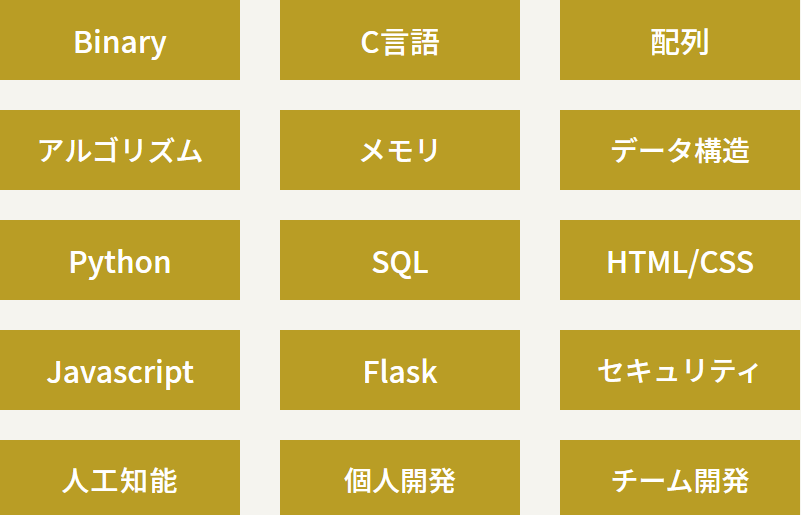

## Why?これをやったか

もともと、エンジニアを目指しており、チーム開発経験をつみたかった。無料のプログラミングスクールなので、費用がかからない点も良心的だなと思った。

## 実際

カリキュラム内容はとても難しく、C言語を中心にPythonやフレームワークを中心に学んでいった。

これを17週間、毎週土曜日やっていった。

はじめのメンバーは300人から始まったが、最終日に残ったメンバーは129人に。

参加者の半数以上がやめていく状況だった。

## どうして続けられた？

基本情報技術者試験の勉強を以前からしており、わからないところを動画で調べていくスタイルで自分は勝負していった。

もちろん不明なところは多かったが、目的意識は常にもちつつ行動していったのが勝敗を分けたと思っている。

## 結果どうだった

自分はサマーインターンでチーム開発を経験し、CodeGymでは目的を変えて勉強していたこともありゆったりと勉強していた。

-   毎週土曜日は確実に拘束される。
-   授業の内容はわからない

ということもあったが、少しでも参加してみたと思う人には参加してほしい。

新しいものに対する勉強の仕方が学べる最高の環境だと思う。そのままエンジニアを目指す人には確実に有益な内容になること間違いなしである。

## これから

自分は基本情報技術者試験に向けて、頑張ろうと思っている。現在は成果物を仕上げるのに必死であるが、確実にこれを取得し文系だからエンジニアは無理だろといってくる奴をぶちまかしたい。

以上
