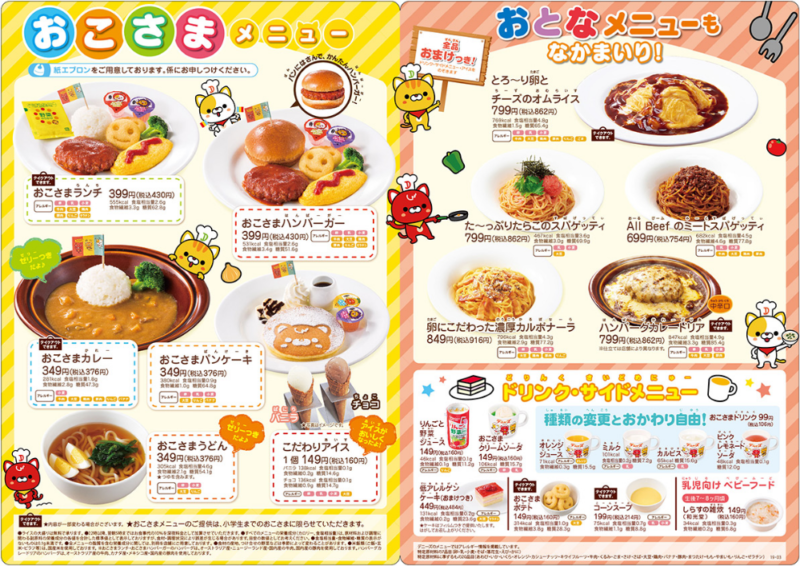
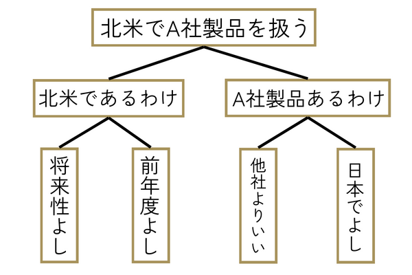

Web系企業のエンジニア職として、内定をして1年無事、大学も卒業でき社会人をスタートすることができた。現時点での学びをアウトプットしていく。

## はじめに

本記事では、研修の内容を元に、2つピックアップしていきます。

-   MECE
-   論理的な話し方をするための情報整理術

ここを具体的に掘り下げつつ解説していきます。

## MECEを知る

もれなくだぶりないか。これを英語で訳するとMECEと呼びます。

モレやダブりが存在すると以下のような状態になってしまうようです。情報を整理するには特に有効な手段みたいですね。

-   モレがある→情報が網羅的でない
-   ダブりがある→情報が整理できていない

### どういうことか

レストランのメニューの構成で考えてみましょう。

kei

レストランのメニュー構成に注目です！

-   ステーキ
-   シーフード
-   ベジタリアン
-   デザート

など、カテゴリごとに類似した料理が含まれています。しかしながらそれぞれが異なる材料や調理方法を持っています。

食事の要求を持つ人が、メニューの中から選択肢を見つけられることが重要です。

-   肉食
-   魚食
-   ベジタリアン
-   特定の食事制限（ダイエット系・低アレルギー系）

を考慮していることが必要です。

この構造が保たれていることでお店の運営も効率的になります！

### MECEでないとどうなる

レストランのメニューの事例に引き続いていうと

顧客が混乱しやすくなってしまい、

お店側は在庫の管理やオーダー管理等が難しくなってしまうんですね。

kei

MECEって意識してないけど非常に大事な考え方なんだと実感しました

## 論理的に整理する

複雑な論理をきれいきれいに組み立てる方法を学びました。

### ピラミッドストラクチャー

全体像を理解するには、階層構造（ピラミッド）のように情報を整理するの有効です。主張とデータを整理する。もしくはデータを元に根拠を作って主張を支えることを示します！

#### 頭がスッキリする整理の仕方…

北米でA社の商品を取り扱いたいとする。その時に、必要なことはどういうことか。

以下、2点の理由が必要になってくると思います。

1.  北米である理由（南米とかではない理由）
2.  A社の商品である理由（B社・C社の商品ではない理由）

#### 北米である理由

ここを述べるために、根拠として

-   マーケット将来予測で北米地域将来性が高い（仮）
-   前年でのマーケット動向が北米で好調である（仮）

こういった根拠が必要になってくると思います。

#### A社の製品である理由

ここを述べるために、根拠として

-   B社・C社の製品との比較の結果、A社が優位であること
-   日本国内でA社の製品が好調であること

こういった根拠が必要になってくると思います。

### 情報をロジックツリーで整理する

主張：北米でA社製品の販売を扱うべき！

-   根拠1：北米である理由
    -   将来性よし
    -   前年で好調

-   根拠2：A社製品である理由
    -   B社・C社よりいい
    -   日本でいい

したがって、北米でA社の製品を扱うべきだよねという結論になるのです！

これをピラミッドストラクチャーで書いてみます。

こんな感じになるわけです。めちゃくちゃスッキリしているなぁと思いました笑

## おわりに

研修で学んだ重要な思考のテクニックをアウトプットしました。MECEもピラミッドストラクチャーの情報整理術もどれも素晴らしくいい内容です。

どんどん応用していきたいですね。
