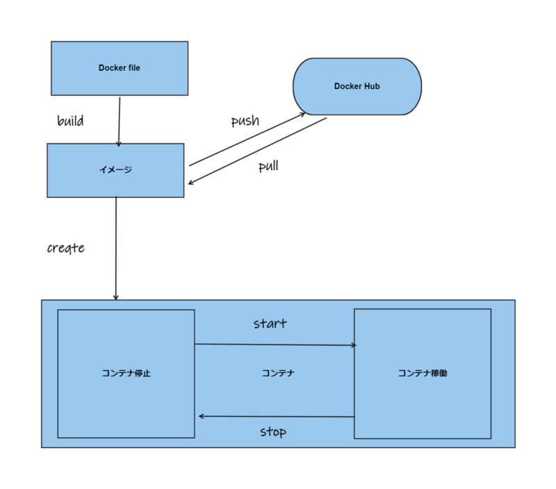

## Dockerとは

軽量なコンテナ型アプリケーション実行環境のことをさしています。クジラのロゴが印象的ですよね

### Dockerを使うメリットってなんぞや？

メリットとしては以下

1.  軽量でかつ高速なマシン
2.  環境が共通している
3.  柔軟性がある

などいろいろとでてくると思います。バージョンごとに環境変えることができるのも良いと個人的には思います。まだその恩恵を感じていない笑

詳しくは：[https://docs.docker.jp/](https://docs.docker.jp/)

### Laravel Sailとは

LaravelSail は、Laravel を Docker 開発環境で動作させるためのツールとされているそうです。

Laravel を動作させるための一通りの仕組みが構築され、簡単に Docker での開発環境を構築する事ができます。

https://readouble.com/laravel/9.x/ja/sail.html

### 仕組み

自分なりにですが整理してみました。

1.  Dockerfileを記入
2.  `build` してコンテナのイメージを作成
3.  イメージからコンテナをcreateしてコンテナを作成
4.  コンテナを起動：start　コンテナ停止：stop

こんな感じがコマンドになります。

※基本はイメージをpull しながら、コンテナを作成することが多いのかも。

### DockerでLaravelを動かすなら

最近はSailという最強のアイテムを活用することで、簡単に構築できます。

基本に戻ると、

Linux上に、Webサーバー（nginx or apache） をいれて、その上にアプリケーション・サーバー（PHP）をいれて、そこにLaravelを動かす感じになります。

※　これが大体の概要

| Laravel |
| --- |
| PHP |
| HTTPサーバー（Apache/ Nginx） |
| OS(Linux・Windows) |
| コンピュータ（ウェブサーバ） |

Dockerでは、Httpsサーバーより上をうまく整えるという感じだと思っています。

詳しくは、もっと勉強していこうかな
