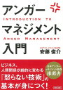
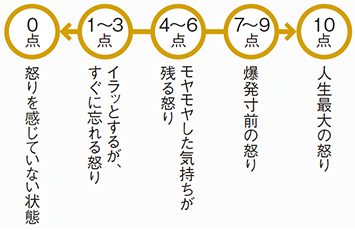
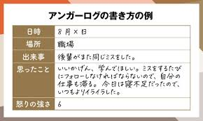

## はじめに

表情にはださないものの、職場で良くも悪くも感情的になりやすい場面が最近は多い。その感情に対して如何にして向き合うのか考えていました。

知人でアンガーマネジメントに詳しい方がおり、その方に聞いてみたところ、アンガーマネジメント協会の安藤さんという方が書いている著書があるらしい。

本を通して、とても学びになったのでそれについて書いていこうと思います。

[アンガーマネジメント入門 （文庫） \[ 安藤俊介 \]](https://hb.afl.rakuten.co.jp/hgc/g00q072f.y9yjc91d.g00q072f.y9yjde4d/Rinker_t_20240613095408?pc=https%3A%2F%2Fitem.rakuten.co.jp%2Fbook%2F14392361%2F&m=http%3A%2F%2Fm.rakuten.co.jp%2Fbook%2Fi%2F18138066%2F&rafcid=wsc_i_is_1000955137366842184)

created by [Rinker](https://oyakosodate.com/rinker/)

-   [楽天市場](https://hb.afl.rakuten.co.jp/hgc/397e1518.1648ea30.397e1519.664875b1/Rinker_o_20240613095408?pc=https%3A%2F%2Fsearch.rakuten.co.jp%2Fsearch%2Fmall%2F%25E3%2582%25A2%25E3%2583%25B3%25E3%2582%25AC%25E3%2583%25BC%25E3%2583%259E%25E3%2583%258D%25E3%2582%25B8%25E3%2583%25A1%25E3%2583%25B3%25E3%2583%2588%2F%3Ff%3D1%26grp%3Dproduct&m=https%3A%2F%2Fsearch.rakuten.co.jp%2Fsearch%2Fmall%2F%25E3%2582%25A2%25E3%2583%25B3%25E3%2582%25AC%25E3%2583%25BC%25E3%2583%259E%25E3%2583%258D%25E3%2582%25B8%25E3%2583%25A1%25E3%2583%25B3%25E3%2583%2588%2F%3Ff%3D1%26grp%3Dproduct)

## 対象読者

この記事においては

-   怒りのメカニズムを知りたい方
-   怒りの具体的な対処法が欲しい方
-   怒りに対する向き合い方を知りたい方

この方たちにむけて発信していこうと思います。

## 怒りにふりまわされる理由

あなたを怒らせているもののの正体は、あなた自身なのです。

> 私は、『誰か』や『何か』によって怒らされているのではなく、私は自分で『怒る』を選んでいる」と気づくこと。
> 
> p.19

つまりどういうことか？具体的な2つのケースをみてみましょう！

### 1つ目

-   「あなたは大好きな人と話をしながら街を歩いていきます。今度の週末はどこにいこうかと楽しい話題に夢中になっています。すると、すれ違いざまに誰かと肩が激しくぶつかりました」

この時、あなたは怒りますか？多分、怒らないはず。

### 2つ目

-   「あなたは会社からの出がけに上司から昨日のミスをひどく注意されました。昨日もさんざん怒られたのにしつこいなぁとイライラしながら街を歩いています。すると、すれ違いざまに誰かと肩が激しくぶつかりました」

この時、あなたは怒りますか？多分、ブチギレますよね。

2つの事例をみて、肩がぶつかったのに別の感情をもっています。不思議ですね。同じ出来事でも置かれている状況が異なれば、人とまったく違う感情をもつということ。

ケイ

あなたは、自分自身で「怒る」という行動を選んでいます！

## 「アンガーマネジメント」の仕組み

自分が怒った時の感情を思い出してみましょう。

-   心臓がどきどきする
-   筋肉が緊張する
-   気持ちが高ぶる
-   呼吸が浅く速くなる

こういった状況になると思います。人間も動物と同じく怒りという機能は変わらないです。

ケイ

人間も動物のように、戦ったり、逃走したりしたら、まあ破綻しますよね笑

### 怒りが生まれるまでの3ステップ

では、どのようにして人は怒りが生まれるのでしょうか？怒りを感じる時は、次の図の3段階をふみます。

1.  「出来事に遭遇」
    -   何らかの出来事があったり、誰かの言動をみたり、聞いたりします。
2.  「出来事の意味づけ」
    -   その出来事、誰かの言動がどういうことなのかを考え、意味づけをします。
3.  「怒りの発生」
    -   意味づけをした結果、自分が許せないものであれば、怒りが生じます

重要なのは第2ステップ。出来事が必ずしも怒りを起こすわけではないということです。

### コアビリーフ

私たちは誰かの言動をみてそれを正しいや間違っているなどと判断します。自分たちが信じているものをアンガーマネジメントでは、「コアビリーフ」と呼びます。

#### 具体的に

飯島さんは割り込みをしようとする車をみます。

飯島

ズルしやがって、ムカつくな！他の車もあいつを絶対わりこませるなよ！

1.  「出来事に遭遇」
    -   わりこみしようとする車を見る
2.  「出来事の意味づけ」
    -   「この車はズルしてわりこもうとしている。ズルはだめだ。ズルした人が得すべきじゃない」
3.  「怒りの発生」
    -   むか〜😤

以下のようなステップで怒りが生まれてしまいます。出来事に対して、どんな意味づけをしているか？自分が信じている「コアビリーフ」は何なのかが非常に大事なポイントになってきます。

自分がどうしてその事柄に腹を立てているからをわかるようになれば、うまく対処しつつコミュニケーションをとって働くことができるはずです。

### アンガーマネジメントの全体像

怒りをうまくコントロールするには、2つの技術があります。

1.  行動の修正
2.  認識の修正

-   行動の修正は、「怒りのままに行動しない」こと。怒りによってまわりの人間関係を築くことを邪魔する行動をとってしまうなら、それを直していきましょうということです。

-   一方で、認識の修正は、「頭の中で怒りにくい仕組みをつくる」こと。あなたの「コアビリーフ」がまわりにマイナスな影響を与えるのならそれを直していきましょうということです。

#### 行動の修正には2つある

1つ目は衝動のコントロールです。これはカッとなったときによけいなことを言わない、しないといったこと。

2つ目は長期的な行動の修正です。コミュニケーションのやり方です。

## 具体的な怒りの抑え方

怒りの感情が湧いた時にどんな対処法ができるか。実践ベースで整理していきます。

### ストップシンキング

頭の中に空白をつくることです。怒りの感情のもとになる出来事の意味づけや思考そのものを停止するということ。誰かに何かを言われたときは、心の中で、

「止まれ！（STOP）」

といいましょう。相手が言ったことや理由・原因この先のことを含め、「一切のことを考えない」ことです。

### ディレイテクニック

反応を遅らせるテクニックのことを言います。怒りを感じた時に、呼吸を4、5回するのです。

もしくは、「カウントバック」といって、100から3ずつ引いて逆算を頭の中でするというテクニックもあります。

### コーピングマントラ

「コーピング」は「対処」のことで、「マントラ」は「呪文」のことを指します。

対人関係で怒りが爆発しそうなとき

マッスル

「相手も悪気があっていってるわけじゃないんだ」

「悪く受とるのはやめよう。きいてみなければ本心はわからない」

「自分がノーと言えるように、相手だってノーっていえる」

### グラウンディング

イライラしてしかたがないときの方法です。意識を「今」、「この場所」に集中するテクニックです。

たとえば、イライラしたとき、目の前にあるペンを持ってみて

マッスル

「そのペンは何色ですか？」

「黒ですか、青ですか、赤ですか？」

「丸いですか、四角いですか？」

「材質は何でできているのでしょうか？」

このように、目の前にあるペンを真剣に観察していると、しだいに言われたことや仕返しをしようという意識は薄れていきませんか？

### タイムアウト

怒りがどうしても抑えられないときは、退却しましょう。その場から離れて頭を冷やす方法です。あくまで「退却戦略」なので、条件があります。

-   感情をもったまま立ち去らないこと
-   相手に「タイムアウトの時間を15分ほどとらせていただいてもよいですか？」などいってからばを離れること

このようなことが重要です。

## 怒りを見える化すること

怒りの正体をもう少し具体的にしっていきましょう。

### スケールテクニック

怒りの強さを数値で計測するということです。怒りを感じた時にこの表を思い出して、自分の怒りを測定してみましょう。

### アンガーログ

自分がものごとをどのように認識しているのか。どのような怒りを感じているのか、どのように行動したのかを記録していく方法です。怒りを「見える化」していきましょう。

-   日時…怒りを感じた日時を書きます
-   出来事…怒りを感じた状況についてかきます
-   思ったこと…その状況をどう思ったのかを書きます
-   感情…その時どのような感情をもったのかをかきます
-   感情の強さ…スケールテクニックを使って感情の強さを測ります

怒りを感じた度に書いてみましょう。

#### アンガーログポイント

-   怒りを感じた瞬間にすぐかくこと
-   なぜ自分はそのように考え、怒ってしまったのかをあんまり強く考えないこと

主観や分析をいれないようにきをつけましょう。自分の怒りではないかのように冷静にきじゅつしましょう。

### ストレスログをつける

「ストレス」と「怒り」の感情は密接しています。ストレスを4つに分類する「ストレスログ」をつけてみましょう。

1.  「重要」かつ「自分で変えられる」
2.  「重要」かつ「自分で変えられない」
3.  「重要でない」かつ「自分で変えられる」
4.  「重要でない」かつ「自分で変えられない」

自分で変えられないものについては受け入れましょう。一方で変えられるものに眼を向けると結構あるはずです。

## 自分の気持ちの上手な伝え方

怒ったとしても怒りのをそのまま相手にぶつけないコミュニケーションについてお話ししたいと思います。

#### 注意すべき言葉：「絶対」「いつも」「必ず」

この言葉は避けましょう。会話が簡単になるから使ってしまうかもしれません。しかし、事実と違う物言いをされたら不快に感じるはずです。

#### 「決めつけ」「レッテルをはる」はやめる

「お前は何もわかっていない」という決めつけや「君は感情的だ」というレッテルをはるのも人間関係をぶち壊します。

#### 大袈裟にいわない、オーバーにいわない

「俺は世界一ついてない」「あんな上司がいるから、結果をだせない」などそれをいうのは、自分の感情を正当化したいからです。このような発言をしてないか見直してみましょう。

#### 主語に”わたしは”をいれてみる

-   「君が遅刻するのから悪いんじゃないか」

-   「君が遅刻すると私はスケジュールがずれるので困ります」

どっちがあなたの思いを伝えることができますか？主語をを意識することで考えを押し付けるニュアンスはかわってくると思います。

## 相手の立場、気持ちをおもいやること

コミュニケーションのコツは、怒りに任せて余計なことをいわない。普段使う言葉を見直すこと、会話の主語を「私は」にするです。さらにもう一歩意識してみるとよいことがあります。

### アサーティブコミュニケーションを意識する

相手の立場や気持ちを尊重しながら、穏当な調子で自分の言いたいことを正確に伝えるコミュニケーションのこと。その時に大事なルールがあります。

-   あなたには言う権利がある
-   あなたの発言が相手を傷つけるとは限らない
-   相手にも言う権利がある
-   相手の意見に一歩的に従わなければいけないというわけではない

自分の思いを主張すること。と同時に相手の思いを聞くこと。この2つを考えながら、攻撃的になることなく、素直で率直に自分の思いを伝えましょう

## おわりに

『アンガーマネジメント入門』を読んだ内容をまとめてみました。実践的な方法が盛りだくさんです。特に、ディレイテクニックの「カウントバック」手法は面白いなとおもいつつ、ジョジョを思い出しました。

怒りにうまく立ち向かっていきたいですね。
