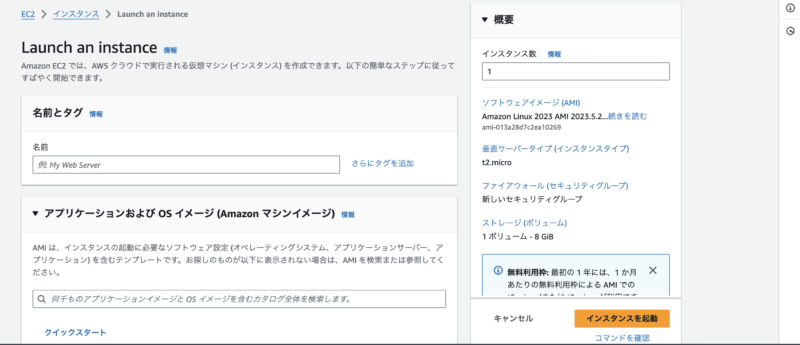

## はじめに

AWSの主力サービスのうち1つにEC2が挙げられます。このEC2というものがどういうものか？どんな設定ができるのか？を見ていきます。

## 対象読者

-   EC2をざっくり理解したい
-   EC2をちょっと触ったことあるけど、本質を掴みたい
-   EC2を実務で使うことになりそう

## EC2とはなにか

Amazon EC2（Elastic Compute Cloud）は、仮想的なサーバー環境を提供するサービスです。デプロイをはじめ、アプリケーションの実行基盤として利用されます。

### 仮想的なサーバーって実際サーバーはない？

EC2は実際のサーバーを使っていますが、それを**仮想的に分けて使えるようにしようぜ**というニュアンスです。事例をもとに考えてみましょう。

[Perplexity](https://www.perplexity.ai/)に質問してみました。

大きなケーキを想像してみてください。これが本物のコンピューターだと思って考えてみましょう。

-   大きなケーキを小さく切り分ける
-   小さく切り分けるとたくさんの人が使えるようになる
-   あなたがほしいケーキの大きさ（サーバーの能力）をいうとAWSが切り分けてくれます（インスタンス）
-   でもこのケーキは魔法のケーキで必要なら大きくしたり、小さくしたりできるのです


ケイ

めちゃくちゃ優秀！ちゃんとわかりやすく解説してくれましたね。

### EC2インスタンスタイプ

EC2は、VPCおよびサブネットに仮想サーバーを配置し、リモートアクセスすることで使います。ここでいう配置するサーバを「インスタンス」と呼びます。


ケイ

サーバを設定するにあたって、CPUはどうするの？メモリはどうするの？などなど考えることはありますよね。

CPU・メモリ・ストレージといったリソースのキャパシティを定義したものをインスタンスタイプとよびます。

**インスタンスタイプの規約**


-   **インスタンスファミリー**  
    Mを基準にスペックを評価します。よりCPU・メモリが必要か？などを検討し選択しましょう
-   **世代**  
    数字が大きいほど新しく高性能です
-   **インスタンスサイズ**  
    インスタンスの性能を決定します  
    サイズが大きいほどCPUやメモリなども大きくなります

https://aws.amazon.com/jp/ec2/instance-types/

## インスタンス起動

AWSの操作画面（マネジメントコンソール）やCLIを用いて、インスタンスを起動します。起動時のフローは以下です。

**インスタンス起動時のフロー**

-   AMIの選択
    -   EC2上で仮想サーバとして動かすOSをAMI（Amazon Machine Image）を選択します。
-   インスタンスタイプの選択
-   インスタンス詳細設定
-   ストレージ設定
-   タグ設定
-   セキュリティグループ設定
    -   インスタンスに割り当てる。セキュリティグループはここでは、ファイヤーウォールとしての役割をもちます。
-   キーペア設定
    -   インスタンスに接続するための必要な公開鍵を選択

**具体的な画面**

AWSの画面に遷移しインスタンスを起動を選択すると、以下のような画面になります。起動時のフローを参考にインスタンスを作成していきましょう。



### EC2インスタンスからAWSリソースへのアクセス

EC2インスタンスから他のAWSサービスへアクセスする際は、IAMを使った権限付与が必要になります。付与する方法は主に2つ存在します

1.  **【非推奨】IAMユーザーの認証情報を設定**
    -   EC2のホームディレクトリにCredentialファイルを配置
    -   環境変数として**AWS\_ACCESS\_KEY\_ID**や**AWS\_SECRET\_ACCESS\_KEY**に認証情報を設定
    -   ※この方法は、認証情報漏洩の観点から避けたほうが無難だといわれています。
2.  **【推奨】IAMロールをEC2インスタンスプロファイルに設定**
    -   EC2インスタンス起動フローの「インスタンス詳細設定」で、IAMロールをEC2に割り当てます

EC2を、アプリケーション実行する用途で活用されます。アプリケーションからAWSリソースへアクセスは通常、SDKを通じて実施します。このときの、次の順序で権限情報を取得します。

1.  環境変数
2.  ホームディレクトリ配下の認証情報
3.  EC2インスタンスプロファイル


ケイ

実務でも感じましたが、AWSがどのような順序で読み込まれるかってわからないものですよね。

### SDKとは

プログラミング言語から、AWSサービスを操作するライブラリです。

例：RubyでAWSのDyanamoDBにアクセスする

```ruby
require 'aws-sdk-dynamodb'

# DynamoDBクライアントの初期化
dynamodb = Aws::DynamoDB::Client.new

# テーブル名
table_name = 'YourTableName'

# アイテムを追加
item = {
  'id' => '1',
  'name' => 'John Doe',
  'age' => 30
}

begin
  dynamodb.put_item({
    table_name: table_name,
    item: item
  })
  puts "アイテムが正常に追加されました"
rescue Aws::DynamoDB::Errors::ServiceError => error
  puts "エラー: #{error.message}"
end

# アイテムを取得
begin
  result = dynamodb.get_item({
    table_name: table_name,
    key: { 'id' => '1' }
  })
  
  if result.item
    puts "取得したアイテム: #{result.item}"
  else
    puts "アイテムが見つかりません"
  end
rescue Aws::DynamoDB::Errors::ServiceError => error
  puts "エラー: #{error.message}"
end
```

こんな感じで、AWSのサービスを使いやすくしてくれます。

## おわりに

ざっくりAWSのEC2をみていきました。

EC2は実際のサーバーを使っていつつも仮想的に分けて使えるようにしようぜというニュアンスでした。次回は、EC2の便利機能、Auto Scalingについてかきます。
