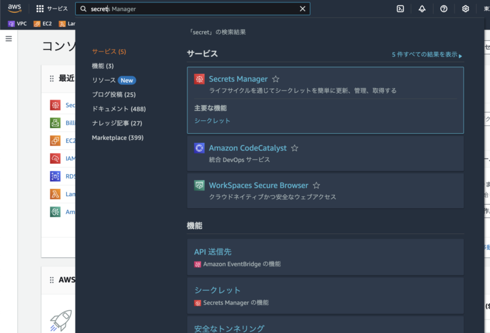

## はじめに

AWSを使用してて、データベースの接続情報や機密情報をちゃんと安全に格納したい。codecommitで直書きしたくない！

そんな時に、便利なのがこのSecrets Managerというサービスです。

では、Secrets Managerでどんなことができるのかをみていきましょう

## Secrets Mangerとは

パスワードやAPIキーなどの機密情報を安全に管理するためのサービスです。

また、secrets Mangerは管理するだけではなく更新や監視などもしてくれるサービスです。


中の人

データベースの認証情報やAPIキーを管理してくれるのはありがたいツールですね

## 使い方

AWSのコンソールからSecrets Managerと検索します。



ページが飛んだら、新しいシークレットを保存するを選択

進んでいくと、設定画面にうつります。

※ここからは事前に、RDSのデータベースを作成しておいてください

※また、AWS CLIの設定をしておいてください

https://qiita.com/suechan/items/98987be0435e23665a52

デフォルトで存在している設定に加えて新たに設定を追加してみましょう。

**設定**

-   シークレットタイプ
    -   RDS データベース
-   認証情報
    -   ユーザー名：DBuser
    -   データベース名：testdbuser
-   データベース
    -   先ほど作成したものを指定
-   シークレットの名前
    -   test/secrets/dbuser
-   ※ ロテーションスケジュールとかはskipでOK！

そこから以下のコマンドをたたいて、値を取得してみましょう。

```sh
$ aws secretsmanager get-secret-value --region ${REGION} --secret-id ${SECRETS_ID}
```

※ ${REGION}と${SECRETS\_ID}は実際の値を入力してください。

※${SECRETS\_ID}は、secretManagementのarnをコピペしてあげるといけます。

こんな結果がでてくるはず！

```jsonc
{
    "ARN": "arn:aws:secretsmanager:ap-northeast-1:488365250163:secret:test/secrets/manager-jufoWe",
    "Name": "test/secrets/manager",
    "VersionId": "e3836102-3661-42f1-a6b9-8a530c2f762e",
    "SecretString": "{\"username\":\"DBuser\",\"password\":\"testdbuser\",\"engine\":\"postgres\",\"host\":\"database-1.cluster-c9wy6e242j6a.ap-northeast-1.rds.amazonaws.com\",\"port\":5432,\"dbClusterIdentifier\":\"database-1\"}",
    "VersionStages": [
        "AWSCURRENT"
    ],
    "CreatedDate": "2024-10-20T13:58:06.131000+09:00"
}
```

## AWS上に存在する類似のサービス

類似サービスとして、**Parameter Store**が存在します。せっかくなのでこちらとの違いを見ていきましょう。

| サービス名 | 更新機能 | 料金 | 用途 |
| --- | --- | --- | --- |
| Secrets Manager | **あり** | 使用量に応じて課金 | 高度な**セキュリティ要件**がある場合 |
| Parameter Store | なし | 基本的に無料（高度な機能は有料） | シンプルな設定管理や、コスト重視の場合 |

料金面に注目すると、Parameter Storeは基本的に**無料**なのはいいですね。

一方で、セキュリティを固めたい場合はSecrets Managerが有効かもしれません。

そして重要な**更新**機能。

こちらは、ローテーション機能と言って、**シークレットを自動で更新してくれる機能**です。認証情報を定期的にローテーション（更新）してくれるのが素晴らしいですね。

## 参考

https://zenn.dev/fdnsy/articles/133db8440d052f

https://qiita.com/hp-Genqiita/items/f93285a6058c64b39f23

https://business.ntt-east.co.jp/content/cloudsolution/column-84.html
