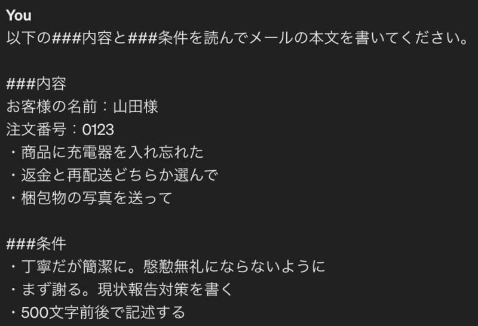

## はじめに

2022年11月30日に公開した生成型AI「ChatGPT」は、猛スピードで世界中に広がり、4日後の12月4日には利用者が世界で100万人を超え、2か月後の2023年1月には1億人を突破したと言われている。

今回はそんなChatGPTで、できることを初心者向けにまとめていこうと思う。ただ、実際の企業で使われそうなものを中心に取り上げる。

## ここの記事で得られること

以下、2つに絞って解説していきたい。

-   ChatGPTを何ができるのか？
-   どうやって入力して出力するのか？

## 基礎用語

-   ChatGPTを使う前に、よく見かける用語をここで抑えたい。

### プロンプト

-   ユーザーがChatGPTに与える入力テキストのこと。モデルはこの入力を受け取り、処理を行なって適切な回答を返す。適切なプロンプトを与えるかが重要になってくる。

### トークン

-   AIが文章を理解するために、言葉を分割した単位のことを指す。また文章をトークンに分割することを「トークン化」と呼ぶ。

> 日本語は英語と違い、単語と単語の間にスペースがないため、文章をどこで区切るかが重要になります。イメージとして、「私は学校に行きます」をChatGPTが理解するためには、「私」「は」「学校」「に」「行き」「ます」という風に分ける必要があります。これがトークン化です。
> 
> [https://shinjidainotobira.com/chatgpt-glossary/](https://shinjidainotobira.com/chatgpt-glossary/)

### プロンプトエンジニアリング

-   ChatGPTやその他のAIから最良の回答を得るために、最適なプロンプトを考え出す技術者のことです。

## テクニック1：謝罪メールを生成する

-   ビジネスメールで謝罪のメールってどう書くの？って思いますよね。（実際、自分も書けない笑）ここでも、ChatGPTが使えます。

#### 該当プロンプト

```text
以下の状況を踏まえて、顧客への謝罪メールを丁寧かつ簡潔に書いてください。慇懃無礼にならないようにしてください。手紙ではないので、敬具は不要です。

購入してもらった商品に、充電器を入れ忘れていた。すぐに再配達の手配をするか、返金の手配をするか選んで欲しい。
相手は山田様。
```

#### 出力結果

```text
件名: 注文商品の充電器の不備についてのお詫びと対応のお願い

山田様

先日は弊社の商品をご購入いただき、誠にありがとうございました。この度、ご注文いただいた商品につきまして、充電器の同梱を見落としてしまったことを深くお詫び申し上げます。

お客様のご利用環境を考慮し、即座に対応させていただきたく存じます。以下の2つの選択肢の中から、ご希望に添える方をお選びいただければと存じます。

再配達の手配: 速やかに充電器を含めた正しい商品を再配達いたします。お手数をおかけいたしますが、再配達の日時についてご指定いただければ幸いです。

返金の手配: 充電器を含まないままの商品をご希望でない場合、迅速にお支払いいただいた金額を全額返金させていただきます。ご指定の口座への返金手続きをすぐに進めさせていただきます。

何かご不明点やご質問がございましたら、いつでもお気軽にお知らせください。お客様のご要望に最善を尽くし、今後このような問題が発生しないよう取り組んでまいります。

お手数をおかけしてしまい、誠に申し訳ございません。何卒ご理解賜りますようお願い申し上げます。

心よりお詫び申し上げます。
```

### ポイント

1.  必要な要件や内容を整理してプロンプトに入れる
    -   礼儀正しすぎても逆効果…
    -   誤りすぎ時は、文章を削除するのもあり！
2.  あらかじめテンプレート作っておくと便利

例えば、以下のようなテンプレートを作ることも可能です。



## テクニック2：見出しやキャッチコピーを生成する

-   見出しやキャッチコピーもいい感じに生成することができます。

#### 該当プロンプト

```text
オリジナルカクテルを提供するイベントを開くので、キャッチーかつ簡潔なイベント名を日本語で10個考えてください。
```

#### 出力結果

```text
ミックスマスターの夜
カクテルクリエイション・フェスティバル
シェイカーパラダイス
ドリンクディスカバリー・ナイト
リキッドアート・エクスペリエンス
カクテルクラフト・キャンバス
ミックス＆ミンゲル・ミーティング
ブレンドマジック・エンカウンター
シェイクアップ・パーティー
ドリンクデザイン・アドベンチャー
```

ちゃんと出てきましたね。もう少し、条件を厳密にしてみましょう。

#### 該当プロンプト

```text
オリジナルカクテルを提供するイベントを開くので、キャッチーかつ簡潔なイベント名を日本語で10個考えてください。

### 条件
キャッチーかつ簡潔に書いてください
カクテルという単語、内容は入れてください
日本語を交えてOKです
サブタイトルは不要です
文字数は20~30文字
```

#### 出力結果

```text
カクテル・クリエイツ
カクテル・カーニバル
カクテル・パラダイス
カクテル・マジック
カクテル・エクスプロア
カクテル・フュージョン
カクテル・フェスタ
カクテル・ワンダー
カクテル・ジャム
カクテル・フリーク
```

### ポイント

-   サブタイトルが不要な指定もできる
-   文字数で制限することもできる（20文字や30文字）

細かいところではありますが、条件文に指定できるのは大きいですね。

## テクニック3：文章構成をリライトする

文章構成を「です・ます」体から「だ・である」体に変換します。

#### 該当プロンプト

```text
以下の文章を覚えて、はいとだけ答えてください

「エンジニアリング」とは、主に科学や数学の原理を応用し、実用的な問題を解決するための技術や方法論の体系的な活動を指します。エンジニアリングの目的は、あらゆる規模や種類のプロジェクトにおいて、効率的で持続可能な解決策を見つけることです。

エンジニアリングは、様々な分野にわたります。例えば、機械工学、電気工学、ソフトウェア工学、化学工学、建築工学などが挙げられます。それぞれの分野は、特定の技術や知識を活用して、特定の問題を解決することを目指しています。
```

#### 出力結果

```text
はい
```

2段階構成なので面白いですね。はいとだけ答えて記憶だけに集中させます。

次は、記憶させたものをリライトして文体を整えさせます。

#### 該当プロンプト

```text
覚えた文章を「〜だ」「〜である」のような文体でリライトしてください。
```

#### 出力結果

```text
エンジニアリングは、科学や数学の原理を応用し、実用的な問題を解決するための技術や方法論の体系的な活動である。その目的は、あらゆる規模や種類のプロジェクトにおいて、効率的で持続可能な解決策を見つけることである。

エンジニアリングは、機械工学、電気工学、ソフトウェア工学、化学工学、建築工学など、様々な分野にわたる。それぞれの分野は、特定の技術や知識を活用して、特定の問題を解決することを目指している。
```

この手法で書けば、卒論もいい感じに文字数が埋まりそう笑

## テクニック4：表計算ツールのガイドさんにする

ベンチャー系の会社だと人が足りなく、一々教えてもらえる時間がない。

そんな時こそ、ChatGPTの出番です。

#### 該当プロンプト

```text
VLOOKUP関数の使い方を教えてください。
```

#### 出力結果

```text
VLOOKUP関数は、ExcelやGoogle Sheetsなどのスプレッドシートソフトウェアで利用される便利な関数です。この関数は、指定した値を含むデータの範囲から、関連する情報を取得します。基本的な使い方は以下の通りです。

=VLOOKUP(検索する値, 検索範囲, 取得する列番号, [範囲の参照形式])
各引数の説明は以下の通りです：

検索する値: 検索したい値を指定します。
検索範囲: 検索する値が存在する範囲を指定します。この範囲は、検索する値が含まれる列と、関連する情報を含む列が含まれます。
取得する列番号: 検索範囲内の何列目のデータを取得するかを指定します。取得したい情報が検索範囲の中で何列目にあるかを数値で指定します。例えば、検索範囲の左端が1列目となります。
例えば、A列に商品コード、B列に商品名が記載された表がある場合、商品コードを元にして商品名を検索したい場合は、以下のようにVLOOKUP関数を使います。

=VLOOKUP(検索する商品コード, A列からB列までの範囲, 2, FALSE)

この式は、指定された商品コードに対応する商品名を取得します。
```

ちなみにもっと踏み込むと、使いたい関数がわからなくても教えてくれます。

#### 該当プロンプト

```text
Googleスプレッドシートの関数を教えてください。A列に日付、B列に売上金額が入っている表があります。売上金額が10万円以上であれば「クリア」、10万円未満であれば「未達成」と表示したい
```

#### 出力結果

```text
Googleスプレッドシートでこれを実現するためには、IF関数を使用します。以下がその方法です。


=IF(B2 >= 100000, "クリア", "未達成")

この式は、B列のセルの値が10万円以上であれば「クリア」を返し、10万円未満であれば「未達成」を返します。B列のセルがそれぞれ売上金額を表していると仮定しています。この式をB列のセルに入力することで、各セルに対して条件に応じた表示が行われます。

たとえば、B2セルに売上金額が入っている場合、上記の式をB2セルに入力することで、そのセルには「クリア」または「未達成」が表示されます。その後、この式を他のセルにコピーすることで、他の売上データに対しても同じ条件で表示が行われます。
```

ほんまに人いらないんじゃない？これで上司に聞く手間が省けそうです

## おわりに

ChatGPTの時短術を見ていきました。

できることが多いと言われても何ができるかがちゃんと把握しておきたいですね。ChatGPTは使えば使うほど、回答の精度が上がっていくみたいなので何度も質問して回答精度を上げていきましょう。
