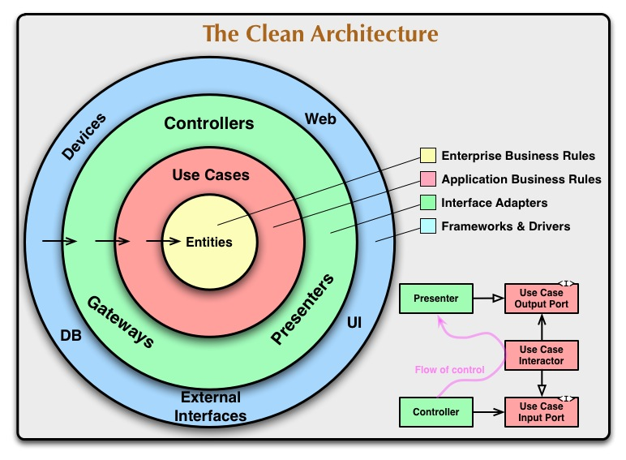
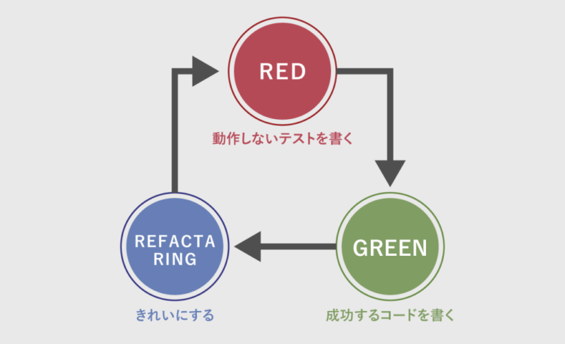

## 本の紹介

PHPでオブジェクト指向を理解しようという本です。

設計入門と記述されているため初学者向けだと思いましたが、密度が濃い印象がありました。

[ちょうぜつソフトウェア設計入門 PHPで理解するオブジェクト指向の活用／田中ひさてる【3000円以上送料無料】](https://hb.afl.rakuten.co.jp/hgc/g00rd1df.y9yjc1d7.g00rd1df.y9yjdf33/Rinker_t_20240217231359?pc=https%3A%2F%2Fitem.rakuten.co.jp%2Fbooxstore%2Fbk-4297132346%2F&m=http%3A%2F%2Fm.rakuten.co.jp%2Fbooxstore%2Fi%2F13036621%2F&rafcid=wsc_i_is_1000955137366842184)

created by [Rinker](https://oyakosodate.com/rinker/)

-   [楽天市場](https://hb.afl.rakuten.co.jp/hgc/397e1518.1648ea30.397e1519.664875b1/Rinker_o_20240217231359?pc=https%3A%2F%2Fsearch.rakuten.co.jp%2Fsearch%2Fmall%2F%25E3%2581%25A1%25E3%2582%2587%25E3%2581%2586%25E3%2581%259C%25E3%2581%25A4%25E3%2582%25BD%25E3%2583%2595%25E3%2583%2588%25E3%2582%25A6%25E3%2582%25A7%25E3%2582%25A2%25E8%25A8%25AD%25E8%25A8%2588%25E5%2585%25A5%25E9%2596%2580%2F%3Ff%3D1%26grp%3Dproduct&m=https%3A%2F%2Fsearch.rakuten.co.jp%2Fsearch%2Fmall%2F%25E3%2581%25A1%25E3%2582%2587%25E3%2581%2586%25E3%2581%259C%25E3%2581%25A4%25E3%2582%25BD%25E3%2583%2595%25E3%2583%2588%25E3%2582%25A6%25E3%2582%25A7%25E3%2582%25A2%25E8%25A8%25AD%25E8%25A8%2588%25E5%2585%25A5%25E9%2596%2580%2F%3Ff%3D1%26grp%3Dproduct)

## なぜこの本を読もうと思った？

イラスト帳のデザインですごく萌えたからです笑

というのは冗談で、本の目次を読んだときに、自分が読みたいなと思うことが詰まっていたからです。

## どんな内容だったか

アーキテクチャ設計において重要な概念をわかりやすく紹介してくれています！

-   クリーンアーキテクチャ
-   パッケージの原則
-   オブジェクト指向
-   テスト駆動開発
-   依存性注入

etc…

生産的なコードを作っていく。安定した設計をしていく。などといった難しいところも優しく書かれているのがすごく読みやすかったです。

## 特に良かったところ

簡潔に2点、紹介します。

### 1点目：クリーンアーキテクチャに対する理解が増した

エンジニアインターンで、インターン先の会社のコードがいわゆる「クリーンアーキテクチャ」になってました。

何を持ってしてクリーンと言われるかと言う部分がすごく腑に落ちました。

実際、何度もこの表を見るのですが、理解できなかったんですよね〜

「フレームワーク」で問題なくね？って思っていたのですが、フレームワークでは解決できない問題って必ずあると思うんですよ。特に事業のドメインがかかるところ。

じゃあ、既成品のフレームワークのように利用しやすい形を作って行こうとしたのが、このクリーンアーキテクチャなんですよ〜って言うところが非常に納得できました。

### 2点目：テスト駆動開発の学び

単体ユニットテストは自分の中でもすごく、おもしろし、境界値などを思考した上でコードを書くというところは人間味があるなと思いました！

ただ、テストは開発プロセスの一種と言う立ち位置が自分の中であったのですが、

テストを意識しながら実装する。

これを意識して実装すれば、後でテストを書く必要性がないなと思いました。

これは別記事で、テストを書きたいですね。

## おわりに

テスト駆動開発とクリーンアーキテクチャについてもう一度、まとめなおそうかなと思いました。

非常に読みやすく、クリーンアーキテクチャ入門にピッタリな本でした。

また、「オブジェクト指向の定義はない」といっていた著者の発言も素晴らしいなと思いました。
