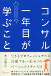

## はじめに

ビジネス書ランキングや新社会人おすすめ本ランキングで上位に登場するのがこの本。なぜ評価されているかが気になり本を手に取りました。

[コンサル一年目が学ぶこと \[ 大石 哲之 \]](https://hb.afl.rakuten.co.jp/hgc/g00q072f.y9yjc91d.g00q072f.y9yjde4d/Rinker_t_20240921201713?pc=https%3A%2F%2Fitem.rakuten.co.jp%2Fbook%2F12862174%2F&m=http%3A%2F%2Fm.rakuten.co.jp%2Fbook%2Fi%2F17038618%2F&rafcid=wsc_i_is_1000955137366842184)

created by [Rinker](https://oyakosodate.com/rinker/)

-   [楽天市場](https://hb.afl.rakuten.co.jp/hgc/397e1518.1648ea30.397e1519.664875b1/Rinker_o_20240921201713?pc=https%3A%2F%2Fsearch.rakuten.co.jp%2Fsearch%2Fmall%2F%25E3%2582%25B3%25E3%2583%25B3%25E3%2582%25B5%25E3%2583%25AB1%25E5%25B9%25B4%25E7%259B%25AE%2F%3Ff%3D1%26grp%3Dproduct&m=https%3A%2F%2Fsearch.rakuten.co.jp%2Fsearch%2Fmall%2F%25E3%2582%25B3%25E3%2583%25B3%25E3%2582%25B5%25E3%2583%25AB1%25E5%25B9%25B4%25E7%259B%25AE%2F%3Ff%3D1%26grp%3Dproduct)

## ざっくり感想

指示待ち人間にならない社会人になる本だと思いました。仕事は「**もらう側も依頼側の期待値を擦り合わせないといけない**」

-   社会人1年目で、仕事の基礎を気づきたい人
-   コンサルとして働く人
-   仕事ができるやつになりたい人

そんな人にむけて書かれた印象をうけました。

## 1\. 期待値をマネジメントする

この本の1章にすべてが詰まっていると思いました。とくに仕事をもらうとき、4つのポイントを明確にしましょう。

1.  仕事の背景や目的
2.  具体的な仕事の成果イメージ
3.  クオリティ
4.  優先順位・緊急度

ケイ

依頼される側もコミュニケーションを通してリードするという表現がよかったです

どういう目的があってやるのか？アウトプットのイメージはどうなのか？3日の100点それとも3時間の60点なのか？先にたいおうしないといけないのか？

それらを意識しましょう

## 2\. ロジックツリーは最強のツール

ロジックツリーがいかに大事かがわかりました。

### ロジックツリーが便利な理由

-   一生使えること
-   捨てる能力が手に入ること
-   全体像がみえること
-   意思決定のスピードが上がること

仕事をやるまえに、まずは考え方を考える。その道筋をどう描いていくのか？このアプローチでいいのか？それを判断するのにうってつけなツールです。

全体像がみえていたら、仕事の緩急もつくし、こいらんわの取捨選択もできますよね。

ケイ

ちなみにこの章で、MECE（もれなくダブりなく）の考えも書かれていて非常に納得感が湧きました

## 3\. 雲雨傘提案

黒っぽい雲がでてきたので、雨が降り出しそうだから、傘をもっていったほうがいい

というたとえ話ですね。具体的な事例ではありますが、すごくわかりやすいと思います。

-   事実：黒っぽい雲が出現
-   解釈：雨降りそう
-   アクション：傘もっていこ

ケイ

この3点を押さえてアウトプットしましょう！

## 4\. 議事録はこのフォーマットで

よんでいて、ここも革命だなと思いました。

-   アジェンダ
-   決まったこと
-   決まらなかったこと（次にもちこすこと）
-   次回にむけて（誰がいつまで）

ケイ

相手が言ったことをすべてメモするのも大事ですが、そのmtgで何がどうなったのかを端的にまとめてある議事録は優れものなはずです

[課題管理表](https://docs.google.com/spreadsheets/d/1tG8vvHmZl8D5DafFHr5nbTH6cKd-c-ypMBnGzWgm35I/edit?usp=sharing)も似たような感じで作成しようと書かれていました。

## 5\. 師匠をみつけること

> 若いうちは、どのような仕事をするかより、誰と仕事をするかのほうが大事。プロフェッショナルの仕事のうち、言語化できる部分は、すでにコモディティになっており、差別化できない。

本にかかれた内容をそのままもってきました。個人的にもすごく納得いく内容で、本当に社会人1年目は誰の下につくかで今後の働き方が変わってくると思っています。

ケイ

相手が言ったことをすべてメモするのも大事ですが、そのmtgで何がどうなったのかを端的にまとめてある議事録は優れものなはずです

また、**守破離の原則**も語られていました。

-   守：師匠の一挙一動を真似る
-   破：師匠と違ったやり方を覚え、幅を広げる
-   離：師匠のやり方を超え、独自の技を生み出す

ケイ

そのまま真似してもパクリにならないのが面白いよなって思っています

## おわりに

個人的に勉強になることばかりでした。特に1年目は、仕事をうまくやりたいと思っていても具体的に何をどうすればいいのかわからない状態になりがちなので、非常いいガイド本でした。

自分はマインドマップを使ってタスクの全体をみていこうと思いました。
