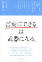
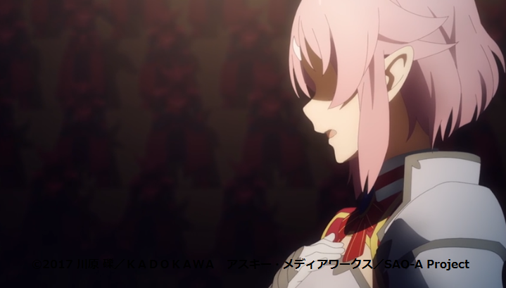
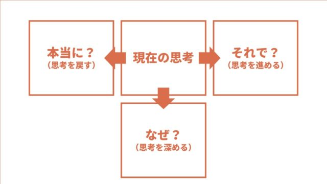

## きっかけ

ビジネス書大全という本のおすすめ文献に入っていて読んでみたいなと思っていました。

## 著者

[「言葉にできる」は武器になる。 \[ 梅田 悟司 \]](https://hb.afl.rakuten.co.jp/hgc/g00q072f.y9yjc91d.g00q072f.y9yjde4d/Rinker_t_20240219230537?pc=https%3A%2F%2Fitem.rakuten.co.jp%2Fbook%2F14309462%2F&m=http%3A%2F%2Fm.rakuten.co.jp%2Fbook%2Fi%2F18081180%2F&rafcid=wsc_i_is_1000955137366842184)

created by [Rinker](https://oyakosodate.com/rinker/)

-   [楽天市場](https://hb.afl.rakuten.co.jp/hgc/397e1518.1648ea30.397e1519.664875b1/Rinker_o_20240219230537?pc=https%3A%2F%2Fsearch.rakuten.co.jp%2Fsearch%2Fmall%2F%25E8%25A8%2580%25E8%2591%2589%25E3%2581%25AB%25E3%2581%25A7%25E3%2581%258D%25E3%2582%258B%2F%3Ff%3D1%26grp%3Dproduct&m=https%3A%2F%2Fsearch.rakuten.co.jp%2Fsearch%2Fmall%2F%25E8%25A8%2580%25E8%2591%2589%25E3%2581%25AB%25E3%2581%25A7%25E3%2581%258D%25E3%2582%258B%2F%3Ff%3D1%26grp%3Dproduct)

梅田悟司さんは、電通にコピーライターとして務めていらっしゃる方です。理系出身で読書経験がないといっても、電通でバリバリ仕事をされている方なので深みがある本だと思います。

## 良かった点

章ごとに3つあって、これを何かしらの形で実践していく。

### 「内なる言葉」と「外に向かう言葉」

「内なる言葉」は物事を考えたり・感じたりするとき、無意識のうちに頭の中で発している言葉のことを指す。

世の中的には、”スキル”や”表現方法”に目がいきがちであるが、内なる言葉こそ大事というスタートは個人的にいいなと思う。  
  
確かに、「外に向かう言葉」というのは型が存在していると思う。その縛りがあって自由度はきかない。

この”内なる言葉”を導くのは、自己との対話が必要不可欠である。そうすることで言葉に幅がでてくる。

#### **重要なのは、どんなときに何を感じているのか？**

-   仲間が困っているときに、自分は何を感じているのか？　
-   仲間が成功しているとき何を感じているのか？

これを考えるようにする。内なる言葉に向き合える

#### **人に動いてもらうには**

人を動かすことはできない。人に動いてもらうようにすることはできる。

#### **志をもち、共有すること**

志：　本気度伝わっている？　→　内なる言葉に目を向けるべき

共有：　ただ伝えるのではなく？　→　なぜこれをやる?どうしてこれをやる？に目を向ける

「内なる言葉」がどれだけ重要なのかがよくわかる気がした。

最近みたSAO WoUのリズの演説で思いが炸裂していたシーンを思い出しました。

*https://akananime.com/archives/18187*

### 内なる言葉　解像度を広げるためにやること

**・午前中に脳内がすっきりしている　→　そこで自分の考えを深める。**

午前中にちょっとはやめに起きて考えごとをするのとかいいのかも

**・T字型思考**

内なる言葉を中央に書き出し、左側に本当に?（再起する）・右側にそれで（進行）・下側にWhy?で考をふかめていく。

これなにでも応用がききそうなのが魅力的

### 伝え方

新しい学びはなく、むしろすでに学んでいることが重要だったりする

#### **中学時に習っていたことを応用させる**

1.  　例える
2.  　繰り返す
3.  　対比
4.  　断定

#### **動詞にこだわる**

　原文：私はこの道を全速力で走った。

　こだわり：私はこの道を疾走した。私はこの道をひた走った。

## おわりに

以上、本を紹介していった。自分は

-   午前中に内なる言葉を広げる時間を用意すること
-   動詞を意識してみること

これらを実践していきたい。
