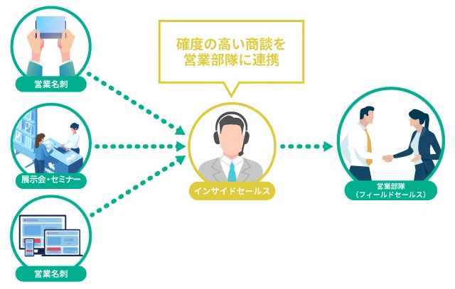
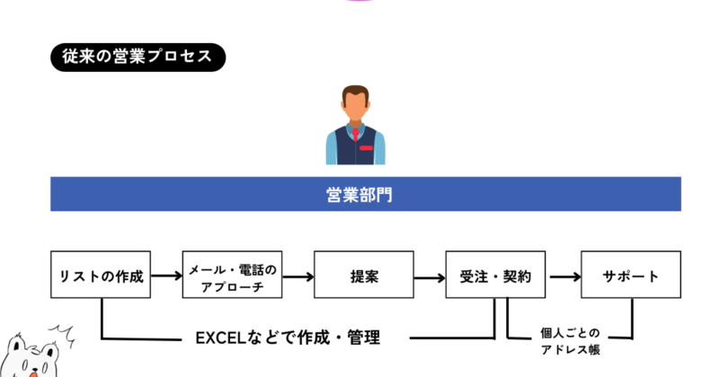
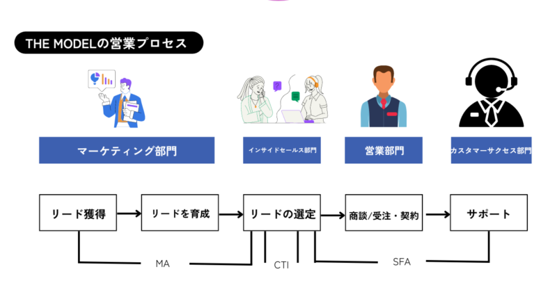

## はじめに

会社のOJTで営業に配属することになりました。仕事の流れを痛感するために、いい体験だと思いつつも営業というと訪問して、直にものを売りにいくイメージが先行している状況です。

しかしながら、現代でいうところの営業は異なる。実際に研修したことを踏まえつつ『THE MODEL』通して、モダンな営業を理解することができたのでそれをまとめる。

## インサイドセールスとは

見込み顧客に対して電話やメールなどを利用して非対面で行う営業活動のことを示します。

マーケティング部門と対面の営業部門との間に入って活動を行います。業務内容は様々です。

## テレアポとインサイドセールスの違い

まず目的が異なります。

-   インサイドセールスはアポイントを得るだけではなく、ヒアリングや情報提供による顧客との関係を作ったり顧客とのデータをあつめたりなど、複数の目的をもっています。
-   テレアポは、アポイントを獲得するという単一の目的だけを追っていきます。

図表

|  | インサイドセールス | テレアポ |
| --- | --- | --- |
| 役割 | 売上・生産性の向上 | アポイント数の増加 |
| KGI | 創出した売上額 | アポイント数 |
| KPI | 受注につながったアポイント数   受注1件あたりにかかったコスト | コール数 |
| トーク手法 | 中長期視点で顧客のニーズを引き出す   オープンクエスチョンがメイン   SPIN手法をもとにしたコミュニケーション | 短期視点でニーズを見極める   クローズドクエスチョンがメイン   一方通行コミュニケーション |
| 顧客リスト | 顧客との信頼関係を構築するため   リストを消費しない | 顧客フォローを行わないため   リストを消費する |
| 目的 | アポイント獲得・見込み客の育成etc… | アポイントの獲得 |
| 営業活動の方法 | 電話、メール、Web会議 | 電話 |

「インサイドセールス勉強会」　[https://www.instagram.com/yukuri\_n/](https://www.instagram.com/yukuri_n/)　より

ざっくりとした違いとしては

テレアポは「収穫」に対して、インサイドセールスは「農作業」（種まき）という感じです。

## 営業プロセスの変化

自分が勤めている会社の営業の方から、「『THE MODEL』を読むと面白いよ」

といわれて買って実際にいくつか読んでみました。

[THE MODEL（MarkeZine BOOKS） マーケティング・インサイドセールス・営業・カスタマーサクセスの共業プロセス \[ 福田 康隆 \]](https://hb.afl.rakuten.co.jp/hgc/g00q072f.y9yjc91d.g00q072f.y9yjde4d/Rinker_t_20240602185517?pc=https%3A%2F%2Fitem.rakuten.co.jp%2Fbook%2F15763607%2F&m=http%3A%2F%2Fm.rakuten.co.jp%2Fbook%2Fi%2F19446888%2F&rafcid=wsc_i_is_1000955137366842184)

created by [Rinker](https://oyakosodate.com/rinker/)

-   [楽天市場](https://hb.afl.rakuten.co.jp/hgc/397e1518.1648ea30.397e1519.664875b1/Rinker_o_20240602185517?pc=https%3A%2F%2Fsearch.rakuten.co.jp%2Fsearch%2Fmall%2FTHE%2BMODEL%2F%3Ff%3D1%26grp%3Dproduct&m=https%3A%2F%2Fsearch.rakuten.co.jp%2Fsearch%2Fmall%2FTHE%2BMODEL%2F%3Ff%3D1%26grp%3Dproduct)

### 読んだ感想

営業ってこんな変わっているんだ！と気づきました〜。

ケイ

従来の営業プロセスどおりの認識だったので、営業に対する見方が180°変わりました。

### 従来の営業

顧客リストを作成して、電話などのアプローチをし、提案して案件を獲得。その後のサポートも実施する。これがかつての営業の流れです

ケイ

営業、向いてないのイメージは全部のステップを実施するところにあるのかなと思います。

### 現在の営業

『THE MODEL』によると、部門がそれぞれ分かれているようです。

-   商品を認知する：マーケティング部門
-   お客様の温度感を測り選定する：インサイドセールス部門
-   実際に受注する：フィルドセールス部門
-   その後の顧客対応をする：カスタマーサクセス部門

こういったように部門ごとにわかれています。

営業部門の範囲って本当に限られるんですよね。だいぶ営業フローがクリアになりました。

## インサイドセールスをやるのに重要なポイント

これは研修を通して私が感じたポイントです。

### 1\. ITツールの導入がしっかりしている

SFA（**Sales Force Automation**）やMA（**Marketing Automation**）といったITツールがいかに大事か実感しました。

ケイ

インサイドセールスの方のやりとりを傍聴したのですが、ログを残して話をしたりどのターゲットに絞っていくかなど本当にITツールの恩恵は計り知れないなと思いました

### 2\. 業務範囲を確認する

インサイドセールスの業務内容って、以上にあるんですよね。

それぞれかける会社の目的も違えば温度感もちがう。なので、ここは要チェックだと思いました。

ケイ

インサイドセールス前後のフィールドセールスとの意思疎通やマーケティングチームの連携なども鍵になってきます。

インサイドセールスでキャリアをつみたいひとにはみておきたいポイントですね。

## おわりに

実際に、最新の営業をOJTで体感してみてすごくいい経験ができたと思っています。

自分はエンジニア志望なのであんまりここまでは詳しくなかったのですが、インサイドセールスとはどういうものかわかってよかったです。
