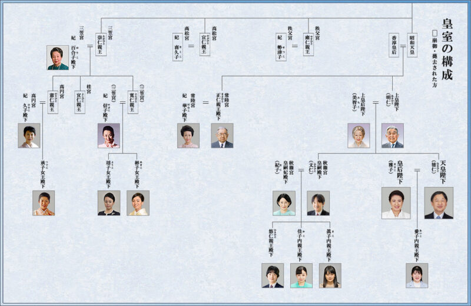

https://www.nikkei.com/article/DGXZQOUA0977U0Z00C21A9000000/?n_cid=SNSTW005

日に日に総裁選に関するニュースが増えてきましたね。

コロナ後の日本をどう立て直すかを国民が考えるきっかけにもなってくるのではないでしょうか。

## 今回は

タイトルにも書いた通り、今回は皇位継承問題をみていきたいと思います。

なぜ、こんな話をするのかというと、以前ある大臣が以上の発言をしたことから疑問に思ってました。

この人を総理にしてしまって本当に大丈夫なのであろうか？

その要因が「女系天皇容認」です。河野大臣のデストロイヤー策は新しい時代を築くには不可欠な勢いですが、皇室までも壊されてしまったらどうしようもないです。

今回は「皇位継承」を焦点にはまとめていきたいとおもいます。

## 皇位継承とは

皇位継承とは何を示しているのかを皆さんは説明できますか？

皇位継承とは**現在の天皇から父方の血筋だけをさかのぼり、初代天皇につながる継承（男系継承**）。

→これは、二千年も前から続いているとのこと

一方で、母方の血筋だけをさかのぼり初代天皇につながるのが本当の**女系継承**とされています。

## 女性天皇と女系天皇の違い

一般に**女性天皇**というのは文字通りの、女性の天皇です。父の血筋だけをたどっていけば初代天皇(神武天皇)につながります。

推古天皇・皇極天皇・斉明天皇・持統天皇・元明天皇・元正天皇・孝謙天皇・称徳天皇  
明正天皇・後桜町天皇

以上、十代八人存在しています。

引用：「歴代の女性天皇について」  
https://www.kantei.go.jp/jp/singi/kousitu/dai3/3siryou3.pdf

いわゆる**、女系天皇**とは  
父の血筋だけをたどっていくと、初代天皇につながらない天皇であり。女系天皇は歴史上、一度も存在していません。

## 何が問題なの？

では何が問題なのでしょうか。  
具体例をもとに考えていきます。

例）愛子さまのお父様は天皇陛下で、お父さんだけをさかのぼれば初代天皇(神武天皇)につながります。  
→愛子さまが天皇になれば、男系の天皇。

仮に山田さんと結婚すると仮定します。その間で生まれた子供が天皇になった場合、お父さんの血筋をさかのぼれば、山田さんの父方の血筋につながります。  
→これは初代天皇につながらないいことになります。

・どこの馬の骨だか、知らない人が天皇になる。(皇室家とは違う人が加わり、一般の人が皇室側の人間になってしまう)

・二千年の歴史が途絶えてしまう。  
→皇位継承により、続いてきた日本の長期的な建国の歴史が損なわれてしまう。

こういう話がでてきてしまうんですね・

## 素朴な感想

以前、女系天皇を容認していた方の意見で、「男系継承は男女差別だ！」とおしゃっている方がいました。（誰とは言いませんが）  
その方に、女性の天皇も歴史をさかのぼれば存在していますので、皇室が男女差別をしているとは言えないのではないでしょうか？といいたいですね。

著者の竹田氏は、以前「女性が天皇を務めることは悪くはないが、女性が天皇を務めたら大変じゃないだろうか？」とおしゃっていました。

確かに。。。「天皇　お仕事」で検索したら

こんなにもやるべきことがあるのですね（まだある汗）

-   内閣総理大臣を任命すること（第6条第1項）
-   最高裁判所長官を任命すること（第6条第2項）
-   憲法改正、法律、政令及び条約を公布すること（日本国憲法第7条第1号）
-   国会を召集すること（第7条第2号）
-   衆議院解散（第7条第3号）
-   国会議員の総選挙の施行を公示すること（第7条第4号）

これは、男性でも骨が折れそうです。  
もちろん、皇室の方は世の中的なイメージもあると思いますし、発言等もかなり慎重にされていらっしゃると思います。

そんな中でもこの伝統が続いているのは誇らしく思いますね。  
温故知新ではないですけど、新しい文化は活かしつつ伝統は守っていきたいものです。

## まとめ

皇位継承を見ていきました。

　女性天皇は過去に存在していたが、女系天皇は今までに存在していない。  
　男系継承が2000年間途絶えることなく続いてきた  
　女系天皇が誕生し、子供が次の天皇になるときみんな納得するのだろうか？

以上を示しました。

みなさんはどう考えますか？

参考文献：『「女性天皇」と「女系天皇」はどう違うのか　今さら人に聞けない天皇・皇室の基礎知識』

引用：「歴代の女性天皇について」  
https://www.kantei.go.jp/jp/singi/kousitu/dai3/3siryou3.pdf
