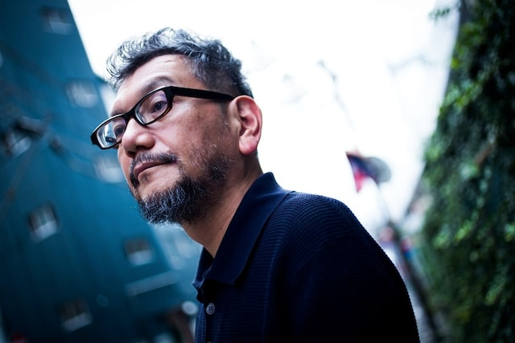
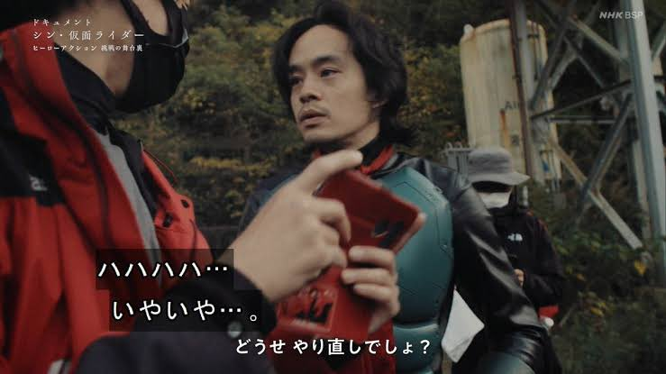
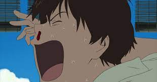
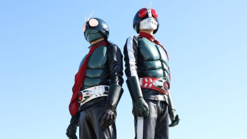
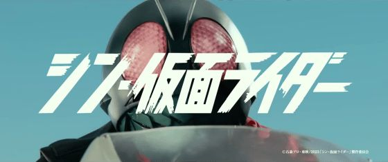
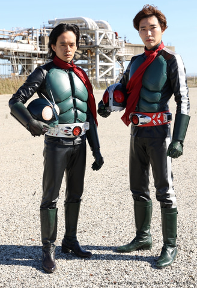
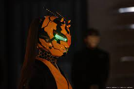
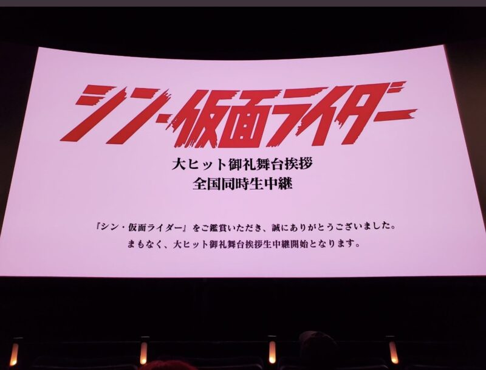

## シン・仮面ライダーを見てきて

この映画で個人的にすごく感じたことがあったので、ここで文章にしておこうと思う。

結論からいうと庵野秀明節炸裂の映画だったし、シンワールドの中でも特に異次元な映画だった。

## 庵野秀明節とは

個人的な解釈であるが、庵野作品は日本作品（映画）の特徴の一つだと思っている。海外の映画は、感情が具体的に表現されていて答えが確実に存在する映画が多い印象。特にアクションとか。

一方で日本の映画は、時の流れや感情がうまく描写されているも答えが存在しない。十人十色の答えを確立することができるという点ではすごくいいが、結局何が言いたいんだろうっていうところで終わってしまうこともある。

日本と海外の対比は、高校の国語の先生の思想が強く根付いていると思っている。

この映画は特に自由なスタイルで実写撮影をしており、答えを演者に託している。それぐらい信頼を寄せていると思ったが、実際はそういう捉え方というよりは、むしろ庵野さん自身の中で答えは存在していて、それを映画というコンテンツで集約する。

付加価値として、演者の特徴をいい感じに映画に反映させていく。それを監督は求めているのだと知った。

## パワハラ疑惑

3月31日にNHK BSプレミアムで放送されたドキュメンタリーでは、撮影現場の様子が色濃く書かれていた。

[『シン・仮面ライダー』庵野秀明、スタッフへの衝撃的な言動に「パワハラ野郎」巻き起こる論争](https://news.yahoo.co.jp/articles/fee3d4f4dbdd0cce4ce11e3effcae3a1712179b5)

個人的に印象的なシーンはアクション監督である田渕さんが、めちゃくちゃ考察された殺陣を現場で披露したのだが、庵野監督曰く、「段取りでしかない」

「段取りとは？」と言いたくなるが、そもそも「殺陣」ってこういうふうな感情でこう攻めてくるから受け流してと一連の段取りではないのだろうか？っと思ったが、庵野監督は、仮面ライダーがやる「殺し合い」をして欲しいということだ。

この道、何年も色々な役者の人の花道を作ってきてその経験から言いたいことがあるにも関わらず、渋々進めていく現場の空気はなんとも言えなかった笑

田渕さん相当色々苦労を経験されているからこそ、こんなことはへでもないんだろうけど、この道を極めたことを突っ込まれるのはすごく痛いんだろうな〜と同時に庵野さんの作品に対するこだわりがよく伝わった。

[田渕さん経歴](https://www.stunt-japan.com/profile/profile-2679/)

## スタントマンなし

仮面ライダーといえば危険なアクションがつきものだと思う。スタントマンは必須だ。でもこの映画の凄さは、ほとんどスタントマンをほぼ起用しないことである。

仮面ライダー1号を演じる俳優の池松 壮亮さんは、何回スーツを着脱して動いたことだろうか？ドキュメンタリーでもすごく体が痛そうな表情が伝わった。

また作品のこだわりが強い庵野監督なので、何回もリテイクをしたとのこと。自己マネジメントって本当に重要だなと気づく。

引用：NHKBSプレミアム　ドキュメント「シン・仮面ライダー」より

公開の2年前には撮影中にけがをしていたらしい。本当に一号ライダーはどれだけの重しを抱えているのか。

[『シン・仮面ライダー』本郷猛役の池松壮亮、早くもけがで松葉づえ「改造手術に失敗…」 庵野氏「50年前と違う本郷猛を」](https://www.oricon.co.jp/news/2208737/full/)

## いざ映画に

なんの予習をすることもなく、平日に夕方の1回目の映画をみた。元々エヴァンゲリヲンが好きなので、庵野ワールドよろしくお願いしまーす。

## 感想

テーマ性がすごくあって純粋に面白かった。

-   **「肉体と精神」：肉体は現世にあるが、精神は来世に飛んでいく遺体安置所の描写**

-   **「幸福論と死生観」：最大多数の最大幸福を求める我々 対 生き残った人類を称賛するショッカー**

-   **「客観的正義」：自分が誰かを救える力があるのに、自分の身体はそれを拒絶する本郷猛。**

-   **「食物連鎖」：エナジーコンバータというシステムで大気中の微粒子生物を自分の栄養として摂取しているシステム**

キャラそれぞれの立ち位置が際立って良かった。キャスティングも正解だと思う。

## かめんらいだ〜？

想像してほしいのが、友人と話をしてて

自分：「昨日、シン仮面ライダーみてきたんだ」っていったら、

友人：「この年で仮面ライダーかよっ」

ってなると思う。日曜の朝にワクワクしながら早起きしていた少年の頃のライダーと全く持って違う。

元々、PG12作品だし。戦闘シーンは血がドバドバ大量に吹き出る。PG12って小学生に助言・指導が必要っていうけど、どういう指導をするんだか意味がわからない。

人間の体内に血液というものがあって、それが仮面ライダーという超人パワーを身に纏った物体が、何万トンくらいの勢いで瞬発的にパンチをするから、血液が吹き出るんだよって説明が正しいと思う。

※　子供用に貼っておく

## 空想の仮面ライダー

自分たちは虚構な空間に仮面ライダーという物体を置くことで安堵しているという前提がある。

ただ仮面ライダー当事者にとっては、正義を貫く責務を持っており、誰かのためなら刺しても殴っても血がとんでも守らなくてはいけない。仮面ライダーは正義というものを形づくった虚構なんだと改めて気付かされた。

意外と盲点な部分は、仮面ライダーというのは元々怪人としての扱い。

そこから正義のヒーローとして確立していくのだということ。**ヒーロー＝仮面ライダー**という前提がいい感じに崩れていった。

## 原作再現か？それとも”シン”か？

自分は当時の仮面ライダーを見ていなかったので、原作に寄せたのかどうかはよくわからない。

けれども、

-   1号ライダーが骨折して2号ライダーに変わったこと
-   最初のオープニング映像のカメラアングル
-   情報機関の男たちの名前

これを見ただけでも、すごく原作リスペクトされている。当時の世代にはどハマりな作品といっても全てがそうではなく、役者の性格や才能を活かした作品でもあったと思う。

森山未來さんのコンテンポラリーダンスを戦闘に落とし込んだのは素晴らしいと思った。

## 個人的見どころ

### 本郷と一文字のやり取り

二人で声を掛け合って戦う場面は何度見ても心おどる。この2人のキャスティング最高だろ。

仮面ライダー2号一文字役（柄本佑さん）のグッチョブサインはあとで監督からいいねをされて取り入れていくのが決まったみたい。

ファンのtwitterを見たけど、一文字の解釈は

「辛いと幸せというのは、紙一重なんだよね。」

という発言があり、

一文字が辛い本郷を支えたから。幸せになれたということらしい。

激萌え😍

### ハチオーグめちゃくちゃ可愛い

なーちゃん（西野七瀬）が演じていたことを鑑賞後に気づいて、驚いたのと、すごく順当に可愛い系のキャラクターでお芝居をやっていくのかなと思いきや。真逆のキャラクターが最高だった。

狂気的なヴィランキャラクターが出せるところがすごくて、色々な演技を見てみたいと思った。

変身シーンは歌舞伎的な感じで艶やか。ツインテールに和服で戦うあの元アイドル最強です。

オーグのマスクが絶妙に萌える。

多分ファンの中でも一番人気が高いキャラクターだと思った。

## 大ヒット御礼舞台あいさつ 2023年4月9日

本日：2023年4月9日、朝早く起きて2回目のシン・仮面ライダーを見てきた。

映画をみる目的は色々あったが、舞台あいさつがあるというのを聞いて。（本当は生で見たかったけど抽選外れた泣）

庵野さんが司会進行をやるとは…

[庵野秀明監督「次回作は白紙」もタイトルは確定？『シン・仮面ライダー』舞台挨拶でファンに感謝](https://moviewalker.jp/news/article/1132552/)

NHKのドキュメンタリー後のネット上では批判されまくっている最中の舞台あいさつだったので、精神的にきつい状況だったんだなと感じた。次回作にも言及していたが、いや正直みたいです笑

でもとりあえず、俳優・役者・監督みんな当分は休もう。いい日曜日でした。
