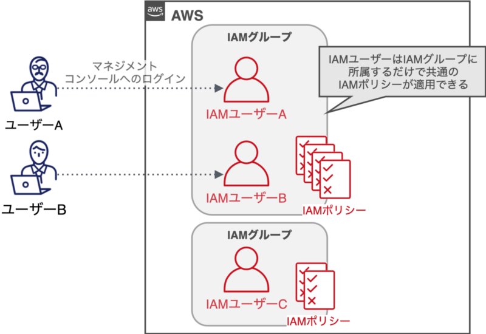
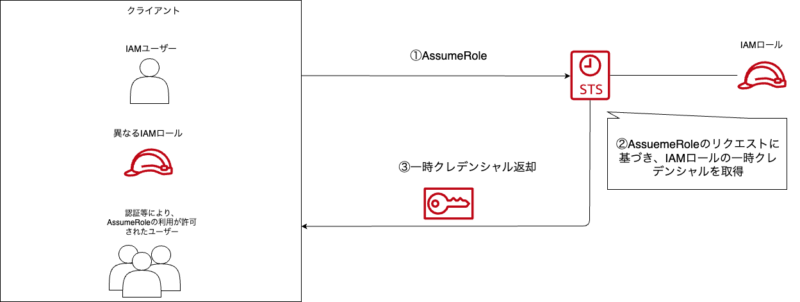

## はじめに

実務でAWSを活用しており、今後AWSの資格を取得することを目指して、勉強に励んでいきたいと思っている。

これからAWSを勉強する人、もしくは今後資格を取得したり、AWSを活用する人の支えになってくれればいいと思いこの記事をかいていく。

## この記事をよむと….

-   IAMについての要点がすぐにわかるようになる。
-   IAMポリシー・IAMユーザー・IAMロールに対しての拒否反応が減る

このような効果がえられます。

## AWSにおけるIAMとは

AWSのサービスやリソースへのアクセスを制御するサービスのことです。ほとんどのAWSサービスはこのIAMで権限管理されます。

### IAMユーザー

AWSアカウント内で作成できるユーザーのこと。各種リソースを操作することができます。

IAMユーザーは、「**アクセスキー**」と呼ばれる、アクセスキーIDとシークレットキーという項目を含んだ文字列の組み合わせを生成できます。


氷の女王

IAMにおけるアクセスキーは何につかうんでしょうか？

#### 活用方法

**①AWS CLIでの活用**

-   AWS CLIとはコマンドラインからAWSを操作できるツールです。設定することでコマンドからAWSサービスを実行できます。
-   例）Lambdaへのデプロイ・S3バケットの保存

**②SDKを使ったプログラムからのアクセス**

-   AWS SDKとは、さまざまなプログラミング言語（Python、Java、Ruby）でAWSサービスにアクセスするためのライブラリです。
-   例）S3バケットへのファイルのアップロード・DynamoDBテーブルへのデータの挿入  
    

**③サードパーティツールでの利用**

-   TerraformやJenkinsなどのインフラツールやCI/CDツールにアクセスするキーを設定することで、これらのツールを通じてAWSリソース管理やデプロイを自動化できます。  
    


ケイ

管理方法については議論の余地がありそうです。

### IAMポリシー

AWSリソースへのアクセス権限を制御する機能のことです。どのサービスの、どのリソースを誰が実行するのかを記述します。

※ ec2インスタンスを起動して止める設定をかいてます。

```jsonc
{
  "Version": "2012-10-17", // 書式のバージョン
  "Statement": [　　　　　　 // 実際に付与する権限と条件を記述する
    {
      "Sid": "StartStopIfTags",  // 識別子
      "Effect": "Allow",         // 【重要】アクションを許可するのか拒否するのかを記述
      "Action": [
        "ec2:StartInstances",    // 【重要】実際に制御したい記述を書く
        "ec2:StopInstances"
      ],
      "Resource":"arn:aws:ec2:region:accout-id:instance/*",  // 【重要】制御するリソースを記述する
      "Condition": {                                         // 条件を詳細に記述する
        "StringEquals": {
         "ec2:ResourceTag/Name": "Sample"
        }
    }
  ]
}
```

### IAMロール

AWSリソースに紐付けられる**役割**のことです。もっとわかりやすくすると、一時的に特定の権限を持たせるための「特殊な社員証」です。

普段、営業部門のいる人が開発部門が扱っているデータをみたいときに、短期的にアクセスできる社員証のようなものを指します。

IAMロールは各リソースに対して、1つ割り当てられます。


ケイ

1つのEC2インスタンスに1つ割り当てられている認識です

### IAMグループ

IAMユーザーをグループ分けする機能です。それぞれのIAMユーザーは複数のIAMポリシーにアタッチ（権限を与えること）ができます。

各IAMユーザーにIAMポリシーをアタッチすると管理が複雑になるため

-   IAMポリシーはグループにアタッチ（権限を与えること）する
-   IAMグループにIAMユーザーを所属することで権限管理をする

という方法が推奨されています。



参考：[https://iselegant.hatenablog.com/entry/2020/05/24/215808](https://iselegant.hatenablog.com/entry/2020/05/24/215808)

### 【おまけ】AWS STS（Security Token Service）

AWSリソースや、IAMユーザーをもっていないユーザーやアプリケーションに対して、一時的に認証情報を付与する機能です。一時的認証情報を請求する操作を「**Assume Role**」といいます。


ケイ

この設定、超便利です。LambdaをGUIで生成した際に自動で、AssumeRoleが生成されてたのを覚えています

STSを使うことで、IAMユーザーをつくる必要がなくなり、結果としてIAMユーザーごとに作成されるアクセスキーを管理するひつようがなくなります。

**▼AWS Security Token Service（STS）による権限管理**



## おわりに

AWSのIAMを学習していきました。IAMはわかりにくいところではありますが超重要なところなので抑えたいですね。特にSTSの仕組みにはおどろきでした。次回も引き続きAWSのサービスについてふれていきます。

## 参考

[](https://hb.afl.rakuten.co.jp/hgc/g00rd1df.y9yjc1d7.g00rd1df.y9yjdf33/Rinker_i_20240702200207?pc=https%3A%2F%2Fitem.rakuten.co.jp%2Fbooxstore%2Fbk-4815607850%2F&m=http%3A%2F%2Fm.rakuten.co.jp%2Fbooxstore%2Fi%2F12998884%2F&rafcid=wsc_i_is_1000955137366842184)

[AWSの基本・仕組み・重要用語が全部わかる教科書 見るだけ図解／川畑光平／菊地貴彰／真中俊輝【3000円以上送料無料】](https://hb.afl.rakuten.co.jp/hgc/g00rd1df.y9yjc1d7.g00rd1df.y9yjdf33/Rinker_t_20240702200207?pc=https%3A%2F%2Fitem.rakuten.co.jp%2Fbooxstore%2Fbk-4815607850%2F&m=http%3A%2F%2Fm.rakuten.co.jp%2Fbooxstore%2Fi%2F12998884%2F&rafcid=wsc_i_is_1000955137366842184)

created by [Rinker](https://oyakosodate.com/rinker/)

-   [楽天市場](https://hb.afl.rakuten.co.jp/hgc/397e1518.1648ea30.397e1519.664875b1/Rinker_o_20240702200207?pc=https%3A%2F%2Fsearch.rakuten.co.jp%2Fsearch%2Fmall%2Faws%25E3%2581%25AE%25E5%2585%25A8%25E9%2583%25A8%25E3%2581%258C%2F%3Ff%3D1%26grp%3Dproduct&m=https%3A%2F%2Fsearch.rakuten.co.jp%2Fsearch%2Fmall%2Faws%25E3%2581%25AE%25E5%2585%25A8%25E9%2583%25A8%25E3%2581%258C%2F%3Ff%3D1%26grp%3Dproduct)
