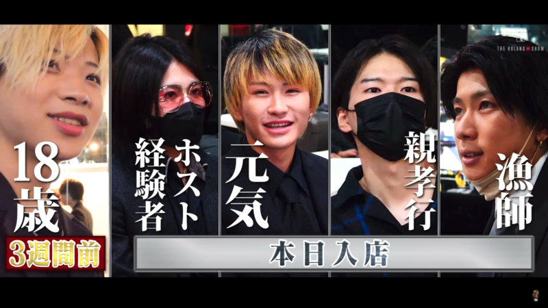

## はじめに

24卒として社会人になりました。エンジニアとしてこれから活躍していこうと思っています。

そんな自分がこの1年インターンをして感じた学びとギャップを話していきます。

## なぜインターンを始めたのか？

同じ部署のインターンで参加していたのは自分だけでした。時給も東京の平均くらい（最低賃金1150円）でやらせていただきました。

家から近いユニクロさんとかで接客すると同じお金だったも事実です。ただ自分として目的があり早めにインターンをしていました。

### 早く実務になれたかったから

個人的なヴィジョンとして2、3年後フリーランスでも仕事がくるエンジニアになりたいと思っています。

自分の価値を上げつつ自由な働き方をしたいと思っています。

そのために必要なものとして何か考えたところ、早めに行動するだと思ったんですよね。

4月スタートで、これから仕事を始めるぞという感じだと不安も多く。事実、新人＝使えないやつと認識されるのが嫌だったのもあります。

### 仕事の時間に教科書を読みたくない

仕事の時間って成果を出すための時間だと思うんですよね。

新卒でツールの使い方やコードの書き方なども知らず、その時間を勉強することになってしまうなと思い、それは嫌だなと思いました。

#### 余談にはなるのですが…

**THE ROLAND SHOW**を見ていて早めに動いている人とそうではない人では、成長のスピードが明らかに違うなと実感しました。

7:44のところです。

しょーだいさんのマインドがすごくて、これそのまんま真似しちゃおうって思いました笑

しょーだいさん

「雑用とかでもよかったので、とりあえず馴染みたくて」

「自分から連絡して自分一番にいきたいです」と伝えました

新しいホストとして、足並み揃えてみんな入社しているにも関わらず、一人だけ早く行動されているんですよね。すごい。本当にすごい。

## インターンをやってきての学び

大きくいうと3点です

-   コミュニケーションの取り方（報・連・相の重要性）
-   仕事の進め方
-   自分たちがどういう立ち位置を求められているのか

これらを痛感することができました。

### 辛かったことから成長を一気に感じることができた瞬間

インターン生は基本出社で、雨の日も雪の日も、風が強い日も自分は往復3時間かけて出社していました笑（お金がなかったから引越しできなかった）

一方で正社員さんは基本、リモートで作業しているんですよね。

出社するメリットって、横について誰かに教えてもらえることだと思ったのですが、それが一歳なかったので、出社する意味ってなに？？ってなってました笑

だからこそ、みんながどんな気持ちで仕事をしているのかよくわからないし、同期もいないし。不安でしたね。

そんな中でも成長できたと実感できたのは、2点あります。

#### 1点目：会社は仕事をやる場所

これ本当にその通りで、大学の延長でインターンをしていた自分は会社でもワイワイ楽しく仕事していたいなあ〜。誰かと喋りながら仕事したいなあと思っていました。

しかし現実ってそうじゃない…

「仕事の目的ってみんな違うもん！」

-   お金のために働く意識を持っている人
-   顧客のために働く意識を持っている人
-   キャリアのために働く意識を持っている人

違うんですよね。じゃあ、そもそも楽しくやるって無理じゃねと思いましたね笑

#### 2点目：目的を達成するために質問をする

自分がインターンしていた部署の先輩、正直聞きづらかったです笑。（楽しく仕事やろうぜマインドで質問したらやけどする）

これを達成するために、この情報が必要でこの辺の知識持っていますか？というのを意識して立ち回ったら、楽になりました。

あんまり仕事に、感情を持ってきてはいけないのだなと痛感しましたね笑

## 働いて感じることのギャップ

これは自分の部署で感じたことなので、全ての会社で当てはまることではないかもしれません。

### 年功序列文化が残っている

会社的には、多様な考え方やヴィジョンはいいよねっていう理念なんです。それがいいなと思ったので入社したのですが結果として、年功序列的な文化があるなと思いました。

-   いいなりになれ
-   素直に受け入れろ

的なニュアンスです。どうしてもインターン先の部署の方からこういう扱いを受けたので、少なからずまだそういう文化はありますね。

口コミや就活サイトの評価が高くても、実際に働くと違うなと実感しています。

### 会社はスペシャリストを求めていない

これもそうで、コードだけ書ければいいとか。この分野だけ詳しくなっていればいいとかを求めていません。

（エンジニアとしてのゼネラリストという意味なら違うかもですが…）

少なからず、自分のやりたい分野や将来のヴィジョンは明確じゃないといいように会社に振り回せれるなと思いました。

## おわりに

インターンを通じて感じた学びと入社後のギャップをまとめました。

これから社会人を歩んでいく方に刺さっていただけるとありがたいですね。

会社問わず、自分のやりたいことがあったらとにかく行動！アウトプットしないと世界は変えられないですねっ
