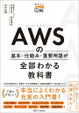
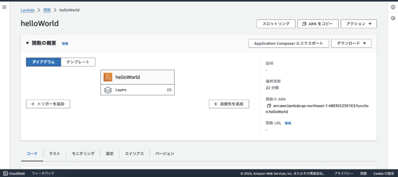
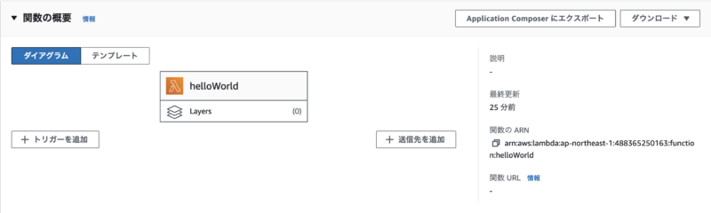
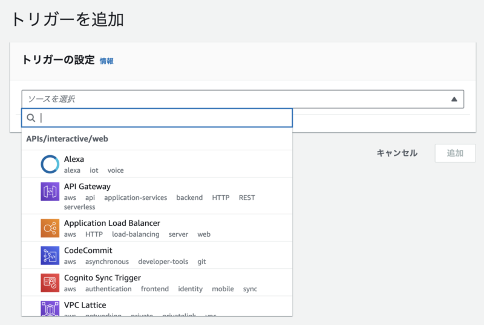
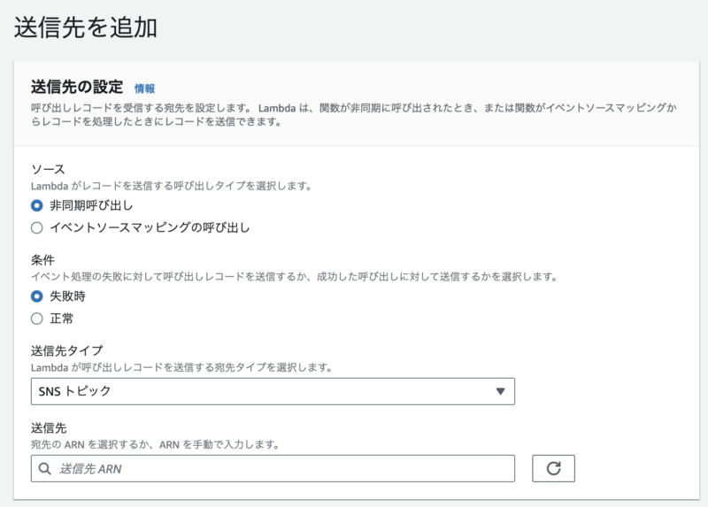
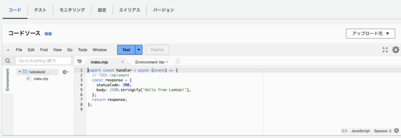
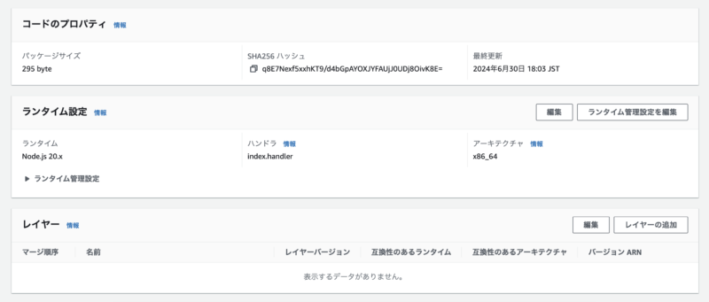
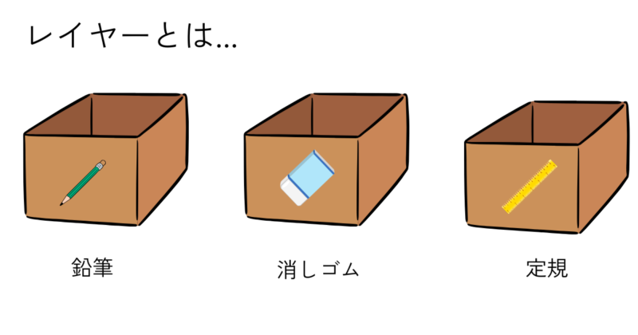
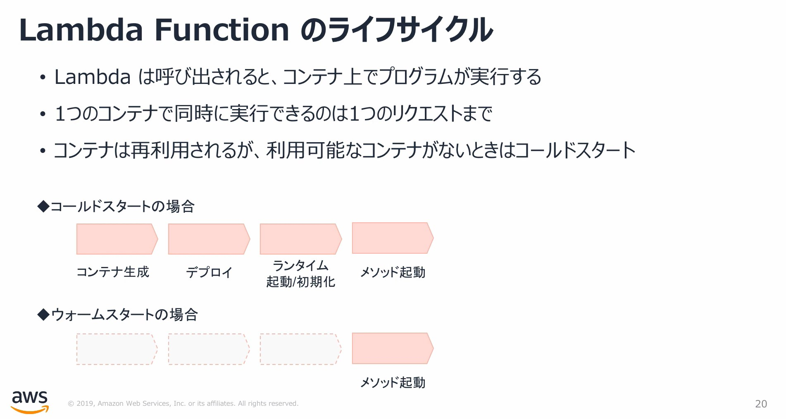
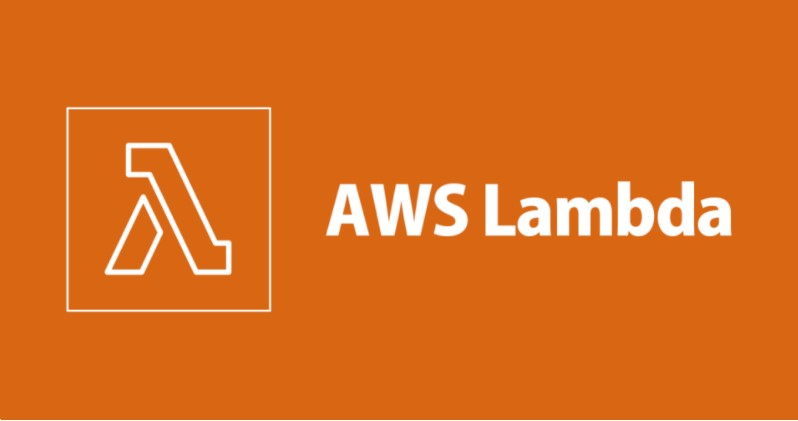

## はじめに

前回の、AWS IAMに引き続き今回は、「Lambda」について解説します。

この記事を読むと

-   Lambdaとはどういうものなのかがわかる
-   Lambdaの関連する用語に悩まない
-   Lambdaがどう動いているのかがわかる

## 参考

こちらの本より引用しています

[](https://hb.afl.rakuten.co.jp/hgc/g00rd1df.y9yjc1d7.g00rd1df.y9yjdf33/Rinker_i_20240702200207?pc=https%3A%2F%2Fitem.rakuten.co.jp%2Fbooxstore%2Fbk-4815607850%2F&m=http%3A%2F%2Fm.rakuten.co.jp%2Fbooxstore%2Fi%2F12998884%2F&rafcid=wsc_i_is_1000955137366842184)

[AWSの基本・仕組み・重要用語が全部わかる教科書 見るだけ図解／川畑光平／菊地貴彰／真中俊輝【3000円以上送料無料】](https://hb.afl.rakuten.co.jp/hgc/g00rd1df.y9yjc1d7.g00rd1df.y9yjdf33/Rinker_t_20240702200207?pc=https%3A%2F%2Fitem.rakuten.co.jp%2Fbooxstore%2Fbk-4815607850%2F&m=http%3A%2F%2Fm.rakuten.co.jp%2Fbooxstore%2Fi%2F12998884%2F&rafcid=wsc_i_is_1000955137366842184)

created by [Rinker](https://oyakosodate.com/rinker/)

-   [楽天市場](https://hb.afl.rakuten.co.jp/hgc/397e1518.1648ea30.397e1519.664875b1/Rinker_o_20240702200207?pc=https%3A%2F%2Fsearch.rakuten.co.jp%2Fsearch%2Fmall%2Faws%25E3%2581%25AE%25E5%2585%25A8%25E9%2583%25A8%25E3%2581%258C%2F%3Ff%3D1%26grp%3Dproduct&m=https%3A%2F%2Fsearch.rakuten.co.jp%2Fsearch%2Fmall%2Faws%25E3%2581%25AE%25E5%2585%25A8%25E9%2583%25A8%25E3%2581%258C%2F%3Ff%3D1%26grp%3Dproduct)

## Lambdaとは

必要なときに必要な分だけアプリケーションを実行できる。サーバーレスなサービスです。AWSのサービスを動かすインフラ（実行環境やサーバー構築など）といったことを考えずに、実行できます。


　ケイ

ソースコードをかくことだけに集中できるのがとても便利ですね

### サーバーレスとは？

「Lambda自体がサーバーを使っていない」ということではありません。サーバーの準備・運用が不要（AWSにお願いしちゃおう！）であることを意味します。

## Lambda関数

さっそく、AWSのマネジメントコンソール画面をのぞいてみましょう。AWSの検索ボックスから「Lambda」を検索し、「helloWorld」という関数を作成してみました。

以下のような画面がでてくると思います。



### 関数の概要

以下の枠をみてみてください  
左側の画面には、helloWorldと書かれておりフレームで囲まれています。



トリガーを追加（左側にある）からは呼び出し元の情報が追加できます。  
API Gateway、EventBridge….などなどを選択できます。



一方で画面右側からは、送信先の情報を選択することができます。送信先タイプなどを選択。



下にスクロールしてみると、ソースコードが記述されていますね。今回は、ランタイムNode.jsを選択し、作成しています。



その下をみてみると、コードのプロパティやランタイム設定やレイヤー情報などが追記できます。



したがって、Lambdaを作成したあとのコンソール画面では、下記のような情報が設定できます。

-   トリガー（呼び出し元）情報
    -   どこからLambdaを呼び出すか
    -   例：API Gateway・EventBridge…
-   送信先情報
    -   どこへ送信するのか
    -   例：SNS・Lambda関数…
-   ランタイム情報
-   レイヤー情報

### ちなみに…

Lambda関数の呼び出し元から連携されるJSON形式のドキュメントのことを「イベント」といいます。

次のドキュメントは、S3にアップロードした際にLambda関数に連携されるドキュメントです。

```jsonc
{
  "Records": [
    {
      "eventVersion": "2.1",
      "eventSource": "aws:s3", // イベントソース：S3にて
      "awsRegion": "us-east-2",
      "eventTime": "2019-09-03T19:37:27.192Z", // イベントの発生時刻：2019年9月3日 19時37分:27.192
      "eventName": "ObjectCreated:Put", //　イベント名：オブジェクトがアップロードされた
      "userIdentity": {
        "principalId": "AWS:AIDAINPONIXQXHT3IKHL2"
      },
      "requestParameters": {
        "sourceIPAddress": "205.255.255.255"
      },
      "responseElements": {
        "x-amz-request-id": "D82B88E5F771F645",
        "x-amz-id-2": "vlR7PnpV2Ce81l0PRw6jlUpck7Jo5ZsQjryTjKlc5aLWGVHPZLj5NeC6qMa0emYBDXOo6QBU0Wo="
      },
      "s3": {
        "s3SchemaVersion": "1.0",
        "configurationId": "828aa6fc-f7b5-4305-8584-487c791949c1",
        "bucket": {
          "name": "DOC-EXAMPLE-BUCKET",
          "ownerIdentity": {
            "principalId": "A3I5XTEXAMAI3E"
          },
          "arn": "arn:aws:s3:::lambda-artifacts-deafc19498e3f2df"
        },
        "object": {
          "key": "b21b84d653bb07b05b1e6b33684dc11b",
          "size": 1305107,
          "eTag": "b21b84d653bb07b05b1e6b33684dc11b",
          "sequencer": "0C0F6F405D6ED209E1"
        }
      }
    }
  ]
}
```

https://docs.aws.amazon.com/ja_jp/lambda/latest/dg/with-s3.html

## より詳しくLambdaをみていく

ランタイムやレイヤーとは何か？少し詳細にみていきましょう

### ランタイムとは

アプリケーションの実行に必要なライブラリやパッケージのこと。ランタイムは大きく2つ存在します。

1.  **標準ランタイム**
    -   下記開発言語が、Lambdaの標準として用意されています。
    -   Node.js・Ruby・Go・Python・Java・.NET Core
2.  **カスタムランタイム**
    -   標準のランタイムでサポートされていないバージョン
    -   その他の言語のランタイムを作成して実行できます


　ケイ

PHPといった開発言語でもLambdaを動かせるのはいいですね。

※ 公式よりサポートされるランタイムと廃止予定日のリストがあるので確認しましょう

https://docs.aws.amazon.com/ja_jp/lambda/latest/dg/lambda-runtimes.html

### レイヤー（Layer）とは

複数のLambda関数が共通で利用するライブラリ、カスタムランタイム、依存関係をZIPファイルで切り出して共有する機能のことです。


　ケイ

なんのことをいっているのか？よくわからないですよね。安心してください！自分もです笑

特別な道具を入れておく「箱」のようなもので、プログラムが便利に動くために使われます。

例えば、あるレイヤーには鉛筆がたくさん入っていて、別のレイヤーには消しゴムがたくさん入っています。Lambdaが動くとき、必要な道具が入ったレイヤーを簡単に使うことができるんです。



LambdaのLayersを使うことで、何度も同じ道具を準備しなくても一度だけレイヤーに入れておけば、いつでもその道具を使えるようになります。

### Extensionsとは

Layersを利用したLambdaの拡張機能です。モニタリングやセキュリティなど、組織の所有者が利用できるようにするLambdaを拡張できます。


　ケイ

また意味不明です笑。さっきは文房具の例で例えたので今度は学校の例で考えましょう

簡潔にいうと、授業中にノートの取り方を教えてくれる先生や、勉強の進み具合をチェックしてくれるツールのようなものです。授業の前や後に役立つ機能を追加してくれるものです。

勉強に専念（Lambdaを実行する）できるようにしてくれるありがたいツールですね。

## 【おまけ】同時実行数

ある時点における、Lambda関数の数のことを「同時実行数」と言います。Lambdaは

1.  **リクエストとコンテナの関係が1対1**
    -   もし、100個のリクエストがきたら100個のコンテナで処理される
2.  **同時実行数には上限値（クオータ）が設定されている**
    -   東京リージョンにおいて最大値が1000に設定
3.  **実行環境自体は、Amazon LinuxもしくはAmazon Linux2をベースとするDockerコンテナ**

とされています。

### Lambdaのライフサイクル

Lambdaの一連の流れは次のようになっています。



[](https://toumasblog.org/aws-lambda)

つまり

1.  コンテナを作成
2.  デプロイパッケージのロード
3.  デプロイパッケージの展開
4.  ランタイムを起動・初期化
5.  関数/メソッドの実行
6.  コンテナを破棄

このステップを踏んで動いているわけですね。

### ウォームスタート

Lambda関数に対してリクエストが継続するときに、コンテナは再利用されます。これをウォームスタートといいます。上の手順でいうと、①〜④に示すところの準備が割愛されます。

### コールドスタート

コンテナが不要と判断されると破棄されて、次回Lambda関数を実行する場合、ゼロからやり直します。これをコールドスタートといいます。

#### 問題

「コールドスタート」は性能上の問題に影響することがあります。

そんなときには、「Provisioned Concurrency」というものを利用して、Lambda関数を事前にセットアップ（インフラを構築）しておくことがよいとされます。


　ケイ

「Provisioned Concurrency」は従量課金制なので注意しましょう！

## おわりに

AWS Lambdaについてみていきました。Lambdaはお手軽に作れて優秀なサービスだと思ってます。ファンもきっと多いですね。

少しずつ、AWSの知識を増やしていきましょう。
