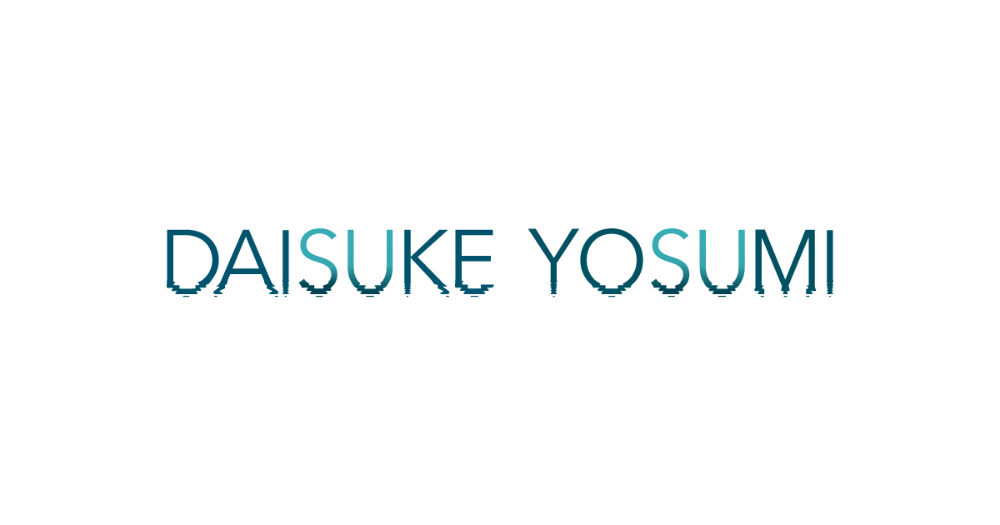
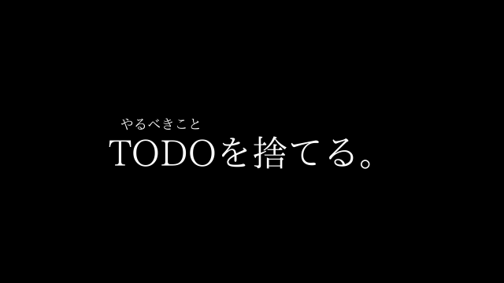
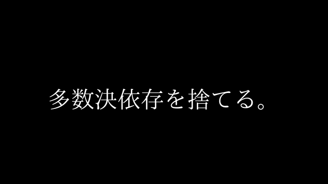
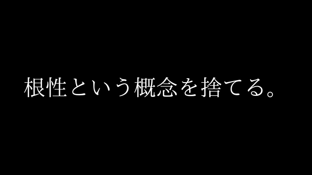
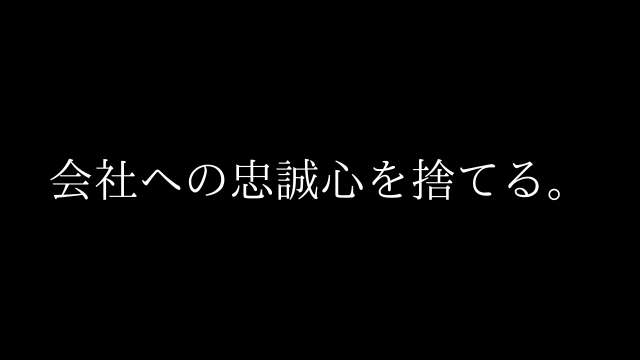
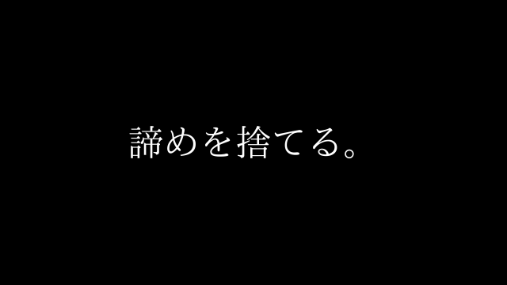
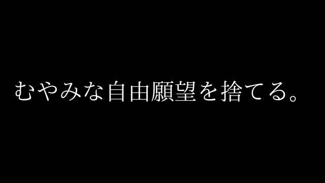

## はじめに

四角大輔さんという、ニュージーランド湖畔の森でサステナブルな自給自足ライフをしている作家兼元プロデューサの経歴をもつ方の生き方や言動が素晴らしく共感し、書店で本を購入しました。

組織や制度に依存しない生き方もをしている彼がどのような言葉を20代に届けるのか非常に気になり完読。

超感動したので、紹介します。

## 感想「いかに減らすか」

人付き合い、出世、プライド、モノ…..

四角さん自身が自分で選んだからこそ、ニュージーランド湖畔の森で暮らすということを実現できたのだと実感しました。

明日の自分が行動を起こせる・変われる・NA（NextAction）を握れるような言葉が多かったため、以下でまとめていきます。

## 紹介する本

※この記事では一部の内容だけを扱います

[自由であり続けるために 20代で捨てるべき50のこと　文庫版 \[ 四角 大輔 \]](https://hb.afl.rakuten.co.jp/hgc/g00q072f.y9yjc91d.g00q072f.y9yjde4d/Rinker_t_20240728192648?pc=https%3A%2F%2Fitem.rakuten.co.jp%2Fbook%2F17812641%2F&m=http%3A%2F%2Fm.rakuten.co.jp%2Fbook%2Fi%2F21213108%2F&rafcid=wsc_i_is_1000955137366842184)

created by [Rinker](https://oyakosodate.com/rinker/)

-   [楽天市場](https://hb.afl.rakuten.co.jp/hgc/397e1518.1648ea30.397e1519.664875b1/Rinker_o_20240728192648?pc=https%3A%2F%2Fsearch.rakuten.co.jp%2Fsearch%2Fmall%2F%25E8%2587%25AA%25E7%2594%25B1%25E3%2581%25A7%25E3%2581%2582%25E3%2582%258A%25E7%25B6%259A%25E3%2581%2591%25E3%2582%258B%25E3%2581%259F%25E3%2582%2581%25E3%2581%25AB%2F%3Ff%3D1%26grp%3Dproduct&m=https%3A%2F%2Fsearch.rakuten.co.jp%2Fsearch%2Fmall%2F%25E8%2587%25AA%25E7%2594%25B1%25E3%2581%25A7%25E3%2581%2582%25E3%2582%258A%25E7%25B6%259A%25E3%2581%2591%25E3%2582%258B%25E3%2581%259F%25E3%2582%2581%25E3%2581%25AB%2F%3Ff%3D1%26grp%3Dproduct)

## 【ワークスタイル】本当に自分がやるべきことか？

> 忙しいときに、TODOリストが溜まっていることはないだろうか？TODOを減らしていく行為は快感だが、心から直結していることなのだろうか？
> 
> 大切にするべきは、TODOリストではなく”**やりたいことリスト**“つまり**ドリームリスト**である。
> 
> あなたの自由を奪うリストは”やるべきこと”は自分の外側で勝手に増えていくが、人生でを解放してくれる”**やりたいこと＝ドリーム”は自分の内側から湧いてくるもの**だ

### 中の人の考察

気づいたらあれもこれもやらないといけないっていう状態はよくあって、その時は本当にやりたいことが見えてこない。

やりたいことは自分の内側から湧いてくるというのが非常に共感。ふとしたときにポロッとでちゃうんだよね笑

ケイ

自分は公園で散歩しているとよくでてきますね笑

#### NA

-   非日常の体験（旅行やキャンプ）をしているときはメモを忘れずにもっていく

## 【ワークスタイル】いけると思ったら、突っ走れ

> あなたが新商品の開発を会社のみんなでするとして、全員の意見を組んだらどうだろうか？全員のニーズは一通り揃うだろう。
> 
> だが、結果として際立つことのない、誰にも喜ばれない商品ができあがる。
> 
> 全員から「まあまあのオッケー」をもらうような、適当な仕事をする必要はない。
> 
> これはいける！と心の声が叫んだら、みんなの顔色は見てみぬふりをしよう

### 中の人の考察

四角さんがよくお話しされている話で

“**100万人に届く歌は、誰かひとりのために創られた曲だ。**“

という話がある。

受けるべき対象がある、注ぐべき情熱を一点に絞ることでとんでもないパワーがでるんじゃないのかなと思っている。

ケイ

特定の誰かって、悩みを持っているだれかなのでビジネス的にもターゲッティングされているんですよね。

#### NA

-   みんなに届けるのではなく、”**あの人**“に届ける

## 【メンテナンス】頂上にたどり着くだけではなく、道のりをすべてを楽しみたい

> 社会人になると、いつも短期的な成果を求められ、気づかないうちに限界以上の仕事を背負わされる状態になる。
> 
> “無理”は続けていくと”慣れ”に変わり、やがて”慣れ”は”日常”となる。
> 
> どんなに仕事が好きでも、疲れ切る前に休むのが、仕事を楽しみ続けるコツだ。

### 中の人の考察

四角さんは、登山家でもある。登頂するというのはどんなに過酷なことか身に沁みているそう。異変を感じたらケアをするのは必須だよな。

ケイ

日本人働きすぎなんだよなああ

#### NA

-   週に1度「がんばりすぎてない？」のチェックをする！

## 【ライフスタイル】ライフラインをいくつか用意する

> あなたがもし営業担当で、得意先が1つしかなければ、そこにしがみつくしかない。相手の言いなりにならざるをえず、革新的でクリエイティブな提案はできなくなる。
> 
> それなのに多くの人は、勤務している会社という”クライアント1社”だけにすがって生きようとする。極めてハイリスクでいちじるしく不自由だ。
> 
> 他にライフラインを確保しておいたほうがいい。自分が他の仕事をする可能性について、シュミレーションとトレーニングを積み重ねていこう。

### 中の人の考察

現実的に、残業をしても給与所得が伸びて税金がとられちゃう。であれば、事業所得で稼ぐ柱を増やすのがメインではないかと思いますね笑

ケイ

コロナショックみたいに何がおきるかわからないですからね。

#### NA

-   小さく小さく事業を始めよう

## 【ライフスタイル】小さな望みをいくつも開放する

> 本当にやりたいことは、みたことも、聞いたこともないところには存在しない
> 
> それは自分の内側に存在する
> 
> 夢は諦めるよりも、忘れてしまうことが多い。だからこそ、夢を忘れない仕組みをつくろう
> 
> -   リビングには、”夢”を彷彿とさせる絵を
> -   寝室には、”夢”につながる大きな地図を
> -   デバイスにの壁紙には”夢”を象徴する画像を貼り付ける
> -   本棚にの一等地には”夢”に近づくための本
> -   会社のデスクには”夢”とリンクするポストカードを並べる
> -   “夢”をイメージさせてくれる曲でプレイリストを作って毎日聴く

### 中の人の考察

どんな望み先に望みがまた生まれて最終的に自分ってこれやりたいんだ〜とか。こういう価値観だったって気づくんですよね〜。

ケイ

すてきすぎる。わくわくしますね笑

#### NA

-   自分が感嘆した写真のポストカードを印刷しデスクに置く

## 【ライフスタイル】実績をだしてから次をめざせ

> 自分には夢があり、やりたいことからがある。と言って、なんの準備もせずに会社もやめれば、きっと後悔する。
> 
> オフィスや備品を使える、同じ空間に同僚がいる、自分の苦手な仕事をやってくれる人がいることが当たり前じゃないことを思い知るからだ。
> 
> 会社を辞めたいと思ったら、まずは余計な付き合いや買い物をすべてやめよう。生活レベルを下げて、どこまでもミニマム・ライフコストを最小化できるか実践しよう。
> 
> そして今いる場所で、どこに行っても通用するマナーと、あらゆる職種で活かせる仕事のベーショックスキルを身につけることに専念しよう。
> 
> 給料をもらいながら勉強させてもらっていると考えれば、つまらないと思っていた業務が”教材”にかわり、不愉快な上司は”教官”に見えてくる

### 中の人の考察

急に収入がいつもの、1/10になったら不安になりますよね。できるだけ生活レベルを下げずに死守したいです。

ケイ

マナーと仕事のベーシックスキルに専念！！

#### NA

-   “**教材**“と”**教官**“をつかいこなせ

## おわりに

四角さんの著書の『自由でありつづけるために20代で捨てるべき50のこと』から一部抜粋してみていきました。社会人になり経て、今がいきづらいなと感じる方にささる内容ではないのでしょうか？

できることから一歩ずつ行動していきましょう。
